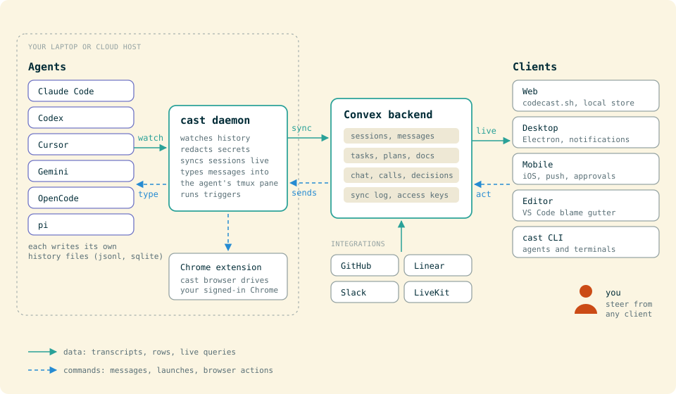

# Contributing to Codecast

## Getting Started

### Prerequisites

- [Bun](https://bun.sh) 1.3+ (package manager and runtime)
- [Convex](https://www.convex.dev) (self-hosted or cloud)
- Node.js 20+ (the Convex CLI runs on it)
- nginx (optional, for local domain routing; `setup-hosts.sh` installs it)

### Setup

1. Clone the repo and install dependencies:
   ```bash
   git clone https://github.com/codecast-sh/codecast.git
   cd codecast
   bun install
   ```

2. Copy environment files:
   ```bash
   cp packages/web/.env.example packages/web/.env.local
   cp packages/convex/.env.example packages/convex/.env.local
   cp packages/cli/.env.example packages/cli/.env.local
   ```

3. Configure your Convex instance URL in each `.env.local`.

4. Start the dev server:
   ```bash
   ./dev.sh      # https://local.codecast.sh (port 3200)
   ./dev.sh 1    # https://local.1.codecast.sh (port 3201, multi-instance)
   ```

   `dev.sh` runs Vite and the gated Convex pusher, which pushes your Convex changes to the deployment in `packages/convex/.env.local`. [Getting Started](docs/GETTING-STARTED.md) covers the full setup.

### Nginx (optional)

`sudo ./setup-hosts.sh` adds the `local.*.codecast.sh` names to `/etc/hosts` and installs the nginx proxy. To configure nginx by hand instead, start from the example:
```bash
cp nginx.dev.conf.example nginx.dev.conf
```

Without either, use `http://localhost:3200`.

## Architecture

Codecast is a Bun monorepo with these packages:

| Package | Description |
|---------|-------------|
| `packages/cli` | `cast` CLI and daemon that watches coding sessions and syncs to Convex |
| `packages/convex` | Convex backend: schema, queries, mutations, auth |
| `packages/web` | React + Vite web app |
| `packages/electron` | Electron desktop app |
| `packages/mobile` | Expo/React Native iOS app |
| `packages/shared` | Contracts and utilities shared by every package (agent registry, render, diff, encryption) |
| `packages/browser-extension` | Chrome extension behind `cast browser` |
| `packages/vscode-extension` | VS Code / Cursor extension for `cast blame` |
| `packages/evals` | Prompt evals against frozen moments |

`platform/packages/` is a generated mirror of shared `@platform/*` packages. Never edit it by hand; see [AGENTS.md](AGENTS.md).



[AGENTS.md](AGENTS.md) (also `CLAUDE.md`) holds the repo's working rules: workspace access vs routing, the local-first store, mobile bundle rules, Convex deploys. Read it before changing any of those areas.

## Code Conventions

### React: No Direct useEffect

`useEffect` is banned in `packages/web` (enforced by ESLint; existing violations are baselined in `eslint-suppressions.json`, so new ones fail). Two escape hatches:

- **`useMountEffect(fn)`** -- one-time external sync on mount
- **`useEventListener(event, handler, target?, options?)`** -- event subscriptions with cleanup

Instead of useEffect, use these patterns:

1. **Derive state, don't sync it.** `const x = f(y)` instead of `useEffect(() => setX(f(y)), [y])`
2. **Data lives in the store.** A Convex query feeds the store (`useSyncCollection`) and the component reads the store (`useCollectionRows`, `useTrackedStore`). See "Store (inboxStore)" in AGENTS.md.
3. **Event handlers, not effects.** User action? Put logic in onClick/onChange directly.
4. **`key` to reset, not effect choreography.** Pass `key={id}` to reset a component.
5. **Conditional mount over guarded effect.** Render only when `ready` is true.

### State Management

All UI state lives in `inboxStore` (Zustand at `packages/web/store/inboxStore.ts`), not in local `useState`. Local state is only for transient, component-scoped concerns (e.g., controlled input mid-edit).

All data mutations go through `inboxStore` actions (optimistic local-first updates), never via direct `useMutation` calls. The pattern:

1. Define an `action()` in `inboxStore.ts` that optimistically mutates local state
2. Add a matching handler in `packages/convex/convex/dispatch.ts` to persist
3. The mutative middleware queues the write in an outbox and dispatches it to Convex after the optimistic update
4. A write the server refuses for good (`isRefusedDispatchError`) is reverted by its caller; any other failure stays queued and the server's echo settles it

### Styling

- Use Tailwind grayscale classes (`text-gray-300`, `text-gray-400`) for subdued text
- Avoid opacity on theme tokens (`text-sol-text-dim/30`) or `text-black/30`

## Checks

```bash
cast check                 # typecheck cli, web and convex through shared tsc watchers
bun test path/to/file.test.ts
```

Run the test files you touched rather than whole suites; CI runs every suite on each pull request. Don't run `tsc --noEmit` directly.

## Deployment

Convex deploys go only through `packages/convex/deploy.sh`, which refuses a tree behind origin/main (a stale tree's snapshot deletes newer functions). Web deploys on every push to `main` (Railway). CLI releases are cut from CI with `gh workflow run cut-cli-release.yml -R codecast-sh/codecast`. See [docs/SELF-HOSTING.md](docs/SELF-HOSTING.md) for self-hosting instructions.

## Commits

Keep history flat: `git pull --rebase`, and rebase on `origin/main` instead of merging it in. Use [Conventional Commits](https://www.conventionalcommits.org/):
```
feat(api): add telemetry endpoint
fix(cli): handle missing config gracefully
refactor(web): extract sidebar into component
```
