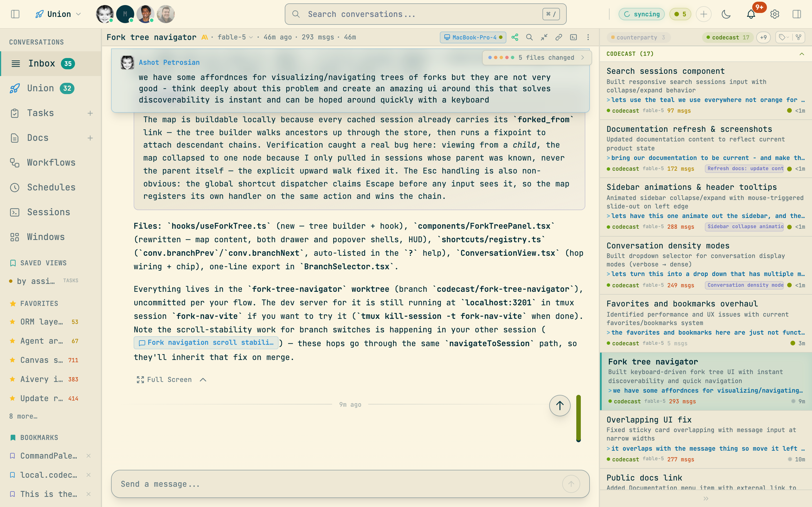
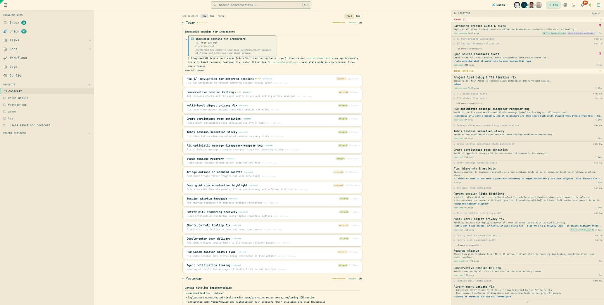
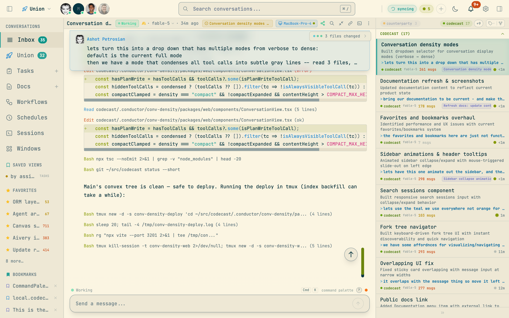
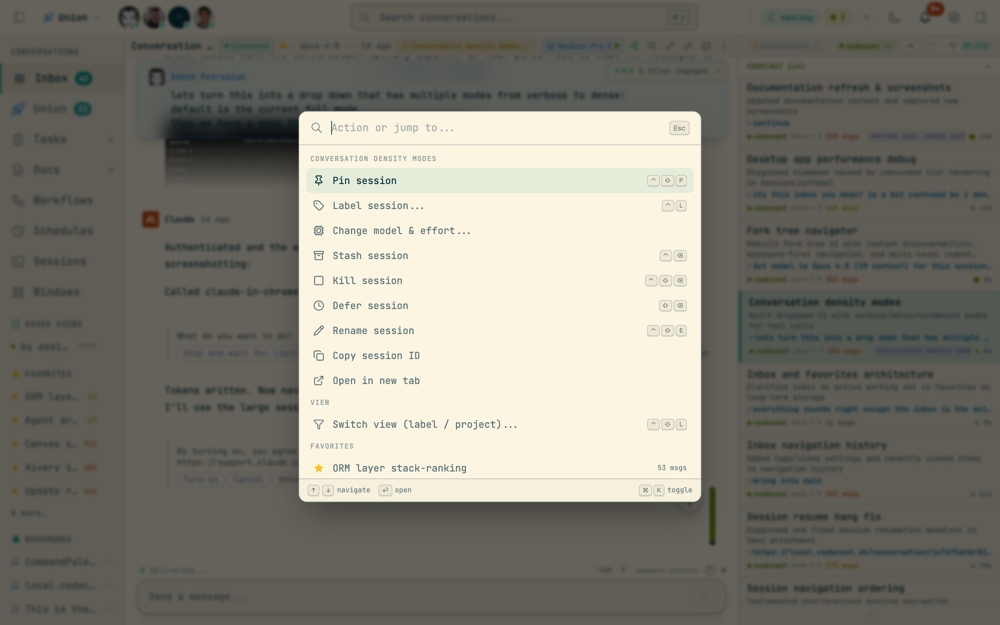
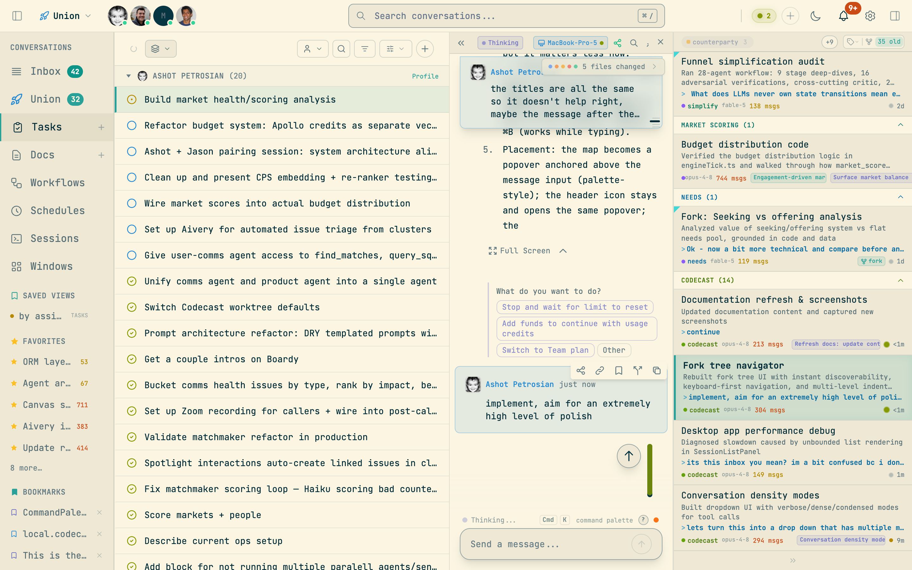
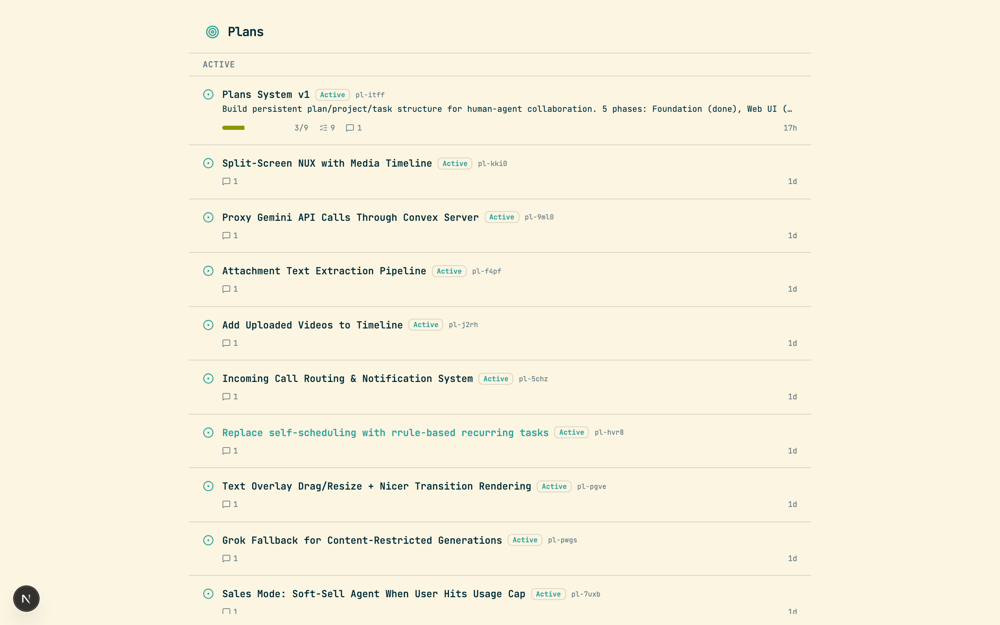

<p align="center">
  
</p>

<h1 align="center">codecast</h1>

<p align="center">
  <strong>The operating system for AI coding agents.</strong><br/>
  Sync, search, orchestrate, and collaborate across every agent conversation — in real time.
</p>

<p align="center">
  <a href="https://codecast.sh">Web Dashboard</a> &middot;
  <a href="#install">Install CLI</a> &middot;
  <a href="#features">Features</a> &middot;
  <a href="docs/SELF-HOSTING.md">Self-Hosting</a> &middot;
  <a href="CONTRIBUTING.md">Contributing</a>
</p>

<p align="center">
  <a href="LICENSE"></a>
</p>

---

Codecast watches your coding agents (Claude Code, Codex CLI, Cursor, Gemini) and syncs every conversation to a shared database. On top of that sync layer, it provides a full workspace for managing the artifacts agents produce: tasks, plans, documents, workflows, and team activity feeds.

It runs as a background daemon with zero manual effort after setup. You get a web dashboard, a native desktop app, a mobile app, and a powerful CLI — all connected in real time.



## Install

```bash
curl -fsSL codecast.sh/install | sh
cast setup
cast start
```

That's it. The daemon runs in the background, watching your agent history files and syncing conversations as they happen.

**Requirements:** macOS or Linux, [Bun](https://bun.sh/) v1.0+

## Features

### Session Sync & Inbox

Codecast watches your local agent history files and syncs conversations to the server in real time. The inbox is a triage queue — sessions are categorized by status (working, idle, needs input, errored) and sorted by priority. Pin important sessions, defer noisy ones, dismiss what's done.



- **Multi-agent support** — Claude Code, Codex CLI, Cursor, Gemini
- **Live status tracking** — see which agents are working, idle, waiting for input, or errored
- **Session categories** — Pinned > Working > Needs Input > Idle > Deferred, with parent/child grouping for sub-sessions
- **Activity feed** — daily digest view organized by project, with narrative summaries and session cards
- **Privacy controls** — mark conversations private, redact API keys and secrets automatically
- **Encryption** — optional end-to-end encryption for sensitive conversations

### Conversation Viewer

Every conversation is rendered with syntax-highlighted code blocks, collapsible tool calls, and inline insights. You can send messages to sessions directly from the web UI to resume them in a new terminal.



- **Tool call rendering** — Bash commands, file reads, grep results, and edits shown as compact summaries with expandable detail
- **Insight blocks** — auto-generated educational explanations from agent sessions
- **Message compose** — send messages to any session, fork conversations, navigate message history with keyboard shortcuts
- **File changes** — see which files were touched, with links to diffs
- **Sub-session hierarchy** — parent sessions show child agent sessions inline

### Command Palette

A Linear-style command palette (`Cmd+K`) for fast navigation across everything — sessions, tasks, plans, docs, and built-in actions.



- **Full-text search** across all sessions and entities
- **Quick navigation** — jump to inbox, tasks, docs, dashboard, settings
- **Session actions** — pin, stash, kill, defer, rename directly from the palette
- **Keyboard-first** — 35+ context-aware shortcuts for power users

### Tasks

Tasks are mined automatically from agent sessions or created manually. They support status cycling, priority levels, labels, plan binding, and dependency tracking.



- **Auto-mining** — tasks are extracted from session insights with confidence scoring
- **Triage system** — suggested tasks can be accepted, dismissed, or edited before promotion
- **Plan grouping** — tasks organized under plans with progress tracking
- **Status workflow** — backlog, open, in_progress, in_review, done, dropped
- **Multiple views** — list view with status grouping, or kanban board with drag-drop
- **Filters** — by status, priority, labels, assignee, source agent, project

### Plans

Plans are higher-level initiatives that group tasks toward a goal. They contain rich documents, task lists with progress bars, and links to the sessions that worked on them.



- **Rich documents** — plans contain TipTap-powered documents with headings, lists, code blocks
- **Task decomposition** — break plans into tasks from the UI or CLI
- **Progress tracking** — see done/in_progress/total at a glance
- **Session linking** — see which agent sessions contributed to a plan
- **Orchestration** — wave-based parallel execution of plan tasks across multiple agents
- **Retrospectives** — auto-generated learnings and friction points after plan completion

### Documents

A collaborative document editor for specs, designs, investigations, handoffs, and notes. Documents can be linked to plans and sessions, and support entity mentions to cross-reference anything in the system.

- **Document types** — note, plan, design, spec, investigation, handoff
- **Rich editor** — TipTap with ProseMirror-based collaborative sync
- **Entity mentions** — `@mention` sessions, tasks, plans, or docs inline
- **Slash commands** — `/` for quick formatting and entity insertion
- **Markdown export** — copy any document as clean markdown

### Workflows

Visual workflow definitions with node-based execution. Define agent, prompt, command, human gate, conditional, and parallel nodes — then run them with live progress tracking.

- **Node types** — agent, prompt, command, human gate, conditional, parallel
- **Human gates** — pause workflows for human input via the regular message composer
- **Live execution** — real tmux sessions per node, streamed to the dashboard
- **Session integration** — workflow runs create primary conversations visible in the inbox

### Teams

Share conversations, tasks, and plans across your team with granular privacy controls.

- **Directory-based sharing** — map project directories to teams for automatic conversation sharing
- **Team activity feed** — see what your teammates' agents are working on
- **Privacy levels** — full, summary, or hidden visibility per conversation
- **Workspace scoping** — switch between personal and team workspaces, each with their own tasks, plans, and docs

### Desktop App

A native macOS app with global keyboard shortcuts, notifications, and a floating command palette.

- **Global palette** — `Cmd+Shift+Space` from anywhere to search and jump to sessions
- **Native notifications** — get notified when agents need input or finish work
- **Auto-updates** — stays current automatically via electron-updater

### Mobile App

An iOS app for monitoring agent sessions on the go.

- **Session browsing** — swipe-to-pin, syntax-highlighted code viewing
- **Push notifications** — stay informed about agent status
- **Inbox parity** — same session queue and categorization as the web

## CLI

The `cast` CLI is both a daemon manager and a power-user interface to the full system.

### Daemon

```bash
cast start              # Start the background sync daemon
cast stop               # Stop the daemon
cast status             # Show daemon status and agent connections
cast logs               # Stream daemon logs
```

### Session Inspection

```bash
cast feed               # Browse recent conversations
cast read <id> 15:25    # Read messages 15-25 of a session
cast read <id> 15 --full # Expand tool calls for a specific message
cast search "auth bug"  # Full-text search across all sessions
cast search "error" -g -s 7d  # Global search, last 7 days
cast similar <id>       # Find sessions that touched the same files
cast blame <file>       # Which sessions modified this file?
```

### Analysis & Context

```bash
cast summary <id>       # Generate a session summary
cast diff <id>          # Files changed, commits made, tools used
cast diff --today       # Aggregate all work done today
cast context "implement auth"  # Find relevant prior sessions
cast ask "how does X work"     # Query across all sessions
cast handoff            # Generate a context transfer document
```

### Task & Plan Management

```bash
cast task create "Fix auth bug" -p high
cast task ls --status in_progress
cast task start <id>
cast task done <id> -m "Fixed by adding guard"
cast plan create "Auth Overhaul" -g "Replace old auth middleware"
cast plan decompose <id>   # Break into tasks
cast plan orchestrate <id> # Run tasks in waves across agents
```

### Documents & Decisions

```bash
cast doc create "Auth Design" -t design
cast doc ls
cast decisions add "Use JWT" --reason "Stateless, works across services"
cast decisions list
```

### Scheduling

```bash
cast schedule add "Check CI" --in 30m
cast schedule add "Review PRs" --every 4h
cast schedule add "Respond to comments" --on pr_comment
cast schedule ls
```

## Architecture

```
codecast/
  packages/
    cli/          CLI daemon, commands, and background sync engine
    web/          Vite + React web dashboard
    convex/       Self-hosted Convex backend (schema, queries, mutations)
    electron/     Native macOS desktop app
    mobile/       iOS/Android app (Expo + React Native)
    shared/       Encryption and cross-platform utilities
  scripts/        Deploy, build, and dev server scripts
  docs/           Specs, plans, and design documents
  infra/          Self-hosted Convex infrastructure (Railway)
```

### Supported Agents

| Agent | History Location | Status |
|-------|-----------------|--------|
| Claude Code | `~/.claude/projects/**/*.jsonl` | Supported |
| Codex CLI | `~/.codex/history/**/*.jsonl` | Supported |
| Cursor | `~/.cursor/` | In Progress |
| Gemini | `~/.gemini/` | In Progress |

### Tech Stack

| Layer | Technology |
|-------|-----------|
| Frontend | React 19, Vite, TailwindCSS, TipTap, Zustand |
| Backend | Self-hosted Convex (real-time sync, auth, full-text search) |
| CLI | Bun, Commander, Chokidar (file watching) |
| Desktop | Electron 33, electron-updater |
| Mobile | Expo 54, React Native |

## Development

### Setup

```bash
bun install
cp packages/web/.env.example packages/web/.env.local
cp packages/convex/.env.example packages/convex/.env.local
cp packages/cli/.env.example packages/cli/.env.local
```

Configure your Convex instance URL in each `.env.local`. See [Self-Hosting](docs/SELF-HOSTING.md) for full setup.

### Run dev servers

```bash
./dev.sh          # http://local.codecast.sh
./dev.sh 1        # http://local.1.codecast.sh (parallel instance)
```

Starts both the Convex backend and Vite web dashboard. The CLI daemon runs separately with `cast start`.

### Type check

```bash
bun run typecheck
```

See [CONTRIBUTING.md](CONTRIBUTING.md) for code conventions and architecture details.

## Documentation

| Guide | Description |
|-------|-------------|
| [Self-Hosting](docs/SELF-HOSTING.md) | Full setup guide: Convex, web, CLI, auth, mobile, desktop |
| [Contributing](CONTRIBUTING.md) | Code conventions, architecture, dev setup |
| [Releasing Mobile](docs/RELEASING-MOBILE.md) | iOS build, TestFlight, and App Store submission |
| [Changelog](CHANGELOG.md) | Version history and release notes |

## Configuration

The CLI stores its config at `~/.codecast/config.json`:

```json
{
  "web_url": "https://codecast.sh",
  "convex_url": "https://convex.codecast.sh",
  "auth_token": "...",
  "team_id": "..."
}
```

Self-hosters: replace the URLs with your own. See [Self-Hosting](docs/SELF-HOSTING.md) for details.

## Privacy & Security

- API keys and secrets are automatically redacted before sync
- Project paths are hashed for privacy
- Optional end-to-end encryption for conversations
- Per-conversation privacy controls (private, summary-only, full)
- Directory-based team sharing with explicit opt-in
- All data stored on self-hosted infrastructure

## Keyboard Shortcuts

| Shortcut | Action |
|----------|--------|
| `Cmd+K` | Command palette |
| `Cmd+/` | Search |
| `Ctrl+J / K` | Next / previous session |
| `Ctrl+I` | Jump to idle session |
| `Ctrl+P` | Jump to pinned session |
| `Ctrl+Shift+P` | Pin/unpin session |
| `Ctrl+Backspace` | Stash session |
| `Ctrl+Shift+Backspace` | Kill session agent |
| `Shift+Backspace` | Defer and advance |
| `Ctrl+N` | New session |
| `Ctrl+Shift+E` | Rename session |
| `D` | Toggle diff panel (in conversation) |
| `T` | Toggle file tree (in conversation) |
| `Alt+J / K` | Next / previous user message |
| `Alt+F` | Fork from message |
| `Ctrl+M` | Focus message input |
| `Ctrl+.` | Zen mode |
| `Ctrl+[ / ]` | Toggle left / right sidebars |
| `?` | Toggle shortcuts help |

## License

[MIT](LICENSE)
