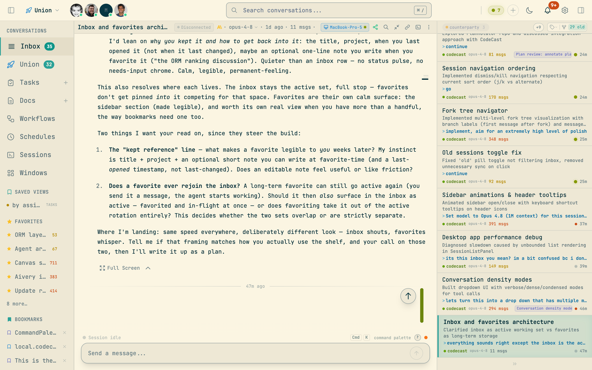

<p align="center">
  
</p>

<h1 align="center">codecast</h1>

<p align="center">
  <strong>The operating system for AI coding agents.</strong><br/>
  Sync, search, orchestrate, and collaborate across every agent conversation — in real time.
</p>

<p align="center">
  <a href="https://codecast.sh">Web Dashboard</a> &middot;
  <a href="#install">Install CLI</a> &middot;
  <a href="#features">Features</a> &middot;
  <a href="docs/SELF-HOSTING.md">Self-Hosting</a> &middot;
  <a href="CONTRIBUTING.md">Contributing</a>
</p>

<p align="center">
  <a href="LICENSE"></a>
</p>

---

Codecast integrates your coding agents (Claude Code, Codex CLI, OpenCode, pi, Cursor, Gemini) into a shared system with global session memory, tasks, plans, documents, and team collaboration. The CLI installs into each agent's config, giving every agent access to the full history of what your team has built — and the ability to create tasks, schedule follow-up work, and orchestrate multi-agent plans.

A background daemon syncs every conversation in real time. You get a web dashboard, a native desktop app, a mobile app, and a CLI that works both from your terminal and from inside agent sessions.


## Install

```bash
curl -fsSL codecast.sh/install | sh
cast setup
cast start
```

On Windows:

```powershell
irm codecast.sh/install.ps1 | iex
```

That's it. The installer ships a prebuilt binary — no runtime required. The daemon runs in the background, watching your agent history files and syncing conversations as they happen.

**Requirements:** macOS, Linux, or Windows

## Features

### Session Sync & Inbox

Codecast watches your local agent history files and syncs conversations to the server in real time. The inbox is a triage queue — sessions are categorized by status (working, idle, needs input, errored) and sorted by priority. Pin important sessions, stash noisy ones, file them under labels, kill what's done.



- **Multi-agent support** — Claude Code, Codex CLI, OpenCode, pi, Cursor, Gemini
- **Live status tracking** — see which agents are working, idle, waiting for input, or errored, with model badges and scheduled-run indicators
- **Session categories** — Pinned > Working > Needs Input > Idle > Deferred, with parent/child grouping for sub-sessions
- **Labels** — file sessions under your own labels (`Ctrl+L`), then switch between label and project views (`Ctrl+Shift+L`)
- **Stash vs. kill** — set a session aside without stopping its agent, or kill the agent outright; killed sessions stay resumable
- **Activity feed** — daily digest view organized by project, with narrative summaries and session cards
- **Privacy controls** — mark conversations private, redact API keys and secrets automatically
- **Encryption** — optional end-to-end encryption for sensitive conversations

### Conversation Viewer

Every conversation is rendered with syntax-highlighted code blocks, collapsible tool calls, and inline insights. You can send messages to sessions directly from the web UI — they're injected into the live terminal session, with delivery verification and retry.


- **Tool call rendering** — Bash commands, file reads, grep results, and edits shown as compact summaries with expandable detail
- **Inline review** — quote and comment on any assistant reply (`R`), batch comments in the composer, and send them as one review
- **Forking** — branch any conversation from any message (`Alt+F`), instantly and local-first; fork chips show the tree inline and `cast tree` prints it
- **Message compose** — send messages to any session, queue follow-ups, approve or deny permission prompts with `Y`/`N`
- **File changes** — see which files were touched, with diffs materialized per edit
- **Kill & restart** — restart a dead or wedged session from the web, with step-by-step progress and recovery
- **Sub-session hierarchy** — parent sessions show child agent sessions inline

### Models & Accounts

Control which model and effort level a session uses — from the web, for both new and running sessions — and switch between Claude Code accounts without touching a browser.

- **Model & effort control** — pick model and reasoning effort when starting a session, or change them mid-flight; one-shot `/model` and `/effort` from the composer
- **Account profiles** — `cast accounts` saves each Claude Code login as a profile and switches between them instantly
- **Usage-limit handling** — blocked sessions surface a banner and can be revived on another account

### Command Palette & Search

A Linear-style command palette (`Cmd+K`) for fast navigation across everything — sessions, tasks, plans, docs, and built-in actions — plus a dedicated search page with keyword and semantic modes.


- **Full-text search** across all sessions and entities, with member, time, and label filters
- **Quick navigation** — jump to inbox, tasks, docs, dashboard, settings; recently viewed sessions at your fingertips
- **Session actions** — pin, stash, kill, label, rename directly from the palette
- **Keyboard-first** — 70+ context-aware shortcuts for power users (`?` shows them all)

### Tasks

Tasks are mined automatically from agent sessions or created manually. They support status cycling, priority levels, labels, plan binding, and dependency tracking.


- **Auto-mining** — tasks are extracted from session insights with confidence scoring
- **Triage system** — suggested tasks can be accepted, dismissed, or edited before promotion
- **Plan grouping** — tasks organized under plans with progress tracking
- **Status workflow** — backlog, open, in_progress, in_review, done, dropped
- **Multiple views** — list view with status grouping, or kanban board with drag-drop
- **Start an agent** — assign a task to an agent and it launches a session with the task bound
- **Filters** — by status, priority, labels, assignee, source agent, project

### Plans

Plans are higher-level initiatives that group tasks toward a goal. They contain rich documents, task lists with progress bars, and links to the sessions that worked on them.

- **Rich documents** — plans contain TipTap-powered documents with headings, lists, code blocks
- **Task decomposition** — break plans into tasks from the UI or CLI
- **Progress tracking** — see done/in_progress/total at a glance
- **Session linking** — sessions auto-link to the plans and tasks they work on
- **Orchestration** — wave-based parallel execution of plan tasks across multiple agents
- **Retrospectives** — auto-generated learnings and friction points after plan completion

### Documents

A collaborative document editor for specs, designs, investigations, handoffs, and notes. Documents can be linked to plans and sessions, and support entity mentions to cross-reference anything in the system.

- **Document types** — note, plan, design, spec, investigation, handoff
- **Rich editor** — TipTap with ProseMirror-based collaborative sync
- **Entity mentions** — `@mention` sessions, tasks, plans, or docs inline; references render as pills with hover previews
- **Date mentions** — `#` inserts dates that link to that day's activity
- **Slash commands** — `/` for quick formatting and entity insertion
- **Markdown export** — copy any document as clean markdown

### Profiles & Notifications

Every member gets a public profile, and you can subscribe to the entities you care about.

- **Public profiles** — `codecast.sh/<handle>` with an activity feed, 180-day contribution heatmap, timeline chart, and punchcard
- **Watch anything** — subscribe to sessions, tasks, plans, or docs and get notified on activity
- **Notification center** — entity events collected in one place, routed by what you watch

### Scheduled Agents

Schedule follow-up work that runs autonomously — check CI in 30 minutes, review PRs every 4 hours, respond when a PR comment lands.

- **Triggers** — one-shot delays (`--in 30m`), recurring intervals (`--every 4h`), or webhook events (`--on pr_comment`)
- **Cloud agents page** — see upcoming and past runs, with full conversation logs
- **Device affinity** — scheduled tasks run on the machine that owns the project
- **Context carryover** — capture the current session's context for the follow-up run

### Workflows

Visual workflow definitions with node-based execution. Define agent, prompt, command, human gate, conditional, and parallel nodes — then run them with live progress tracking.

- **Node types** — agent, prompt, command, human gate, conditional, parallel
- **Human gates** — pause workflows for human input via the regular message composer
- **Live execution** — real tmux sessions per node, streamed to the dashboard
- **Session integration** — workflow runs create primary conversations visible in the inbox

### Teams

Share conversations, tasks, and plans across your team with granular privacy controls.

- **Directory-based sharing** — map project directories to teams for automatic conversation sharing
- **Team activity feed** — see what your teammates' agents are working on
- **Session messaging** — `cast send <id> "text"` messages any session, yours or a teammate's; replies arrive attributed to the sender
- **Privacy levels** — full, summary, or hidden visibility per conversation
- **Workspace scoping** — switch between personal and team workspaces, each with their own tasks, plans, and docs

### Desktop App

A native macOS app with global keyboard shortcuts, notifications, and a floating command palette.

- **Global window toggle** — `Cmd+Alt+Space` from anywhere to summon codecast
- **Global palette** — `Ctrl+Alt+Space` for the floating command palette; `Ctrl+Shift+N` to compose a new session without leaving your editor
- **Native notifications** — get notified when agents need input or finish work
- **Auto-updates** — stays current automatically via electron-updater

### Editor Integrations

Bring session attribution into your editor with `cast blame` — a drop-in `git blame` replacement whose author column shows the codecast session that wrote each line.

- **VS Code / Cursor extension** — blame decorations that link lines to their conversations, with open-at-revision support
- **Vim** — works with vim-fugitive's blame view; jump from a line to the conversation that produced it
- **CLI** — `cast blame src/auth.ts` in any terminal, including porcelain output for tooling

### Mobile App

An iOS app for monitoring agent sessions on the go.

- **Session browsing** — swipe-to-pin, syntax-highlighted code viewing
- **Tasks & plans** — browse tasks and plan details with live sync
- **Push notifications** — stay informed about agent status
- **Inbox parity** — same session queue and categorization as the web

## CLI

The `cast` CLI is an agentic interface that integrates your coding agents — Claude Code, Codex, OpenCode, pi, Cursor, Gemini — into a shared system with global session memory, tasks, plans, docs, and team collaboration. It installs lightweight snippets into each agent's config, giving them access to the full Codecast system from within any conversation.

### Agent Integration

```bash
cast install            # Install snippets into agent configs
cast stable team        # Inject recent team activity into every new session
cast stable solo -g     # Inject your sessions across all projects
```

`cast install` writes to `~/.claude/CLAUDE.md`, `~/.codex/AGENTS.md`, and `~/.cursor/rules/codecast.mdc`, teaching each agent how to use `cast` commands for memory, tasks, plans, and scheduling. After installation, your agents can search past sessions, create and manage tasks, and schedule follow-up work — without any manual copy-paste.

`cast stable` injects a rolling context window of recent conversations into every new agent session, so agents start with awareness of what's been happening across the project or team.

### Session Memory

```bash
cast feed               # Browse recent conversations
cast read <id> 15:25    # Read messages 15-25 of a session
cast search "auth bug"  # Full-text search across all sessions
cast search "error" -g -s 7d  # Global search, last 7 days
cast ask "how does X work"     # Query across all sessions
cast context "implement auth"  # Find relevant prior sessions
cast similar --file src/auth.ts  # Sessions that touched a file
cast blame src/auth.ts  # Which session wrote each line?
cast summary <id>       # Generate a session summary
cast diff --today       # Aggregate all work done today
cast handoff            # Generate a context transfer document
```

These commands work both from your terminal and from inside agent sessions. When an agent calls `cast search` or `cast ask`, it's querying across every conversation your team has had — giving it long-term memory that persists across sessions.

### Live Sessions

```bash
cast sessions           # Work-state snapshot of your sessions
cast sessions -w        # Stream state changes live
cast sessions --state needs-input  # What's waiting on you
cast send <id> "text"   # Message another session
cast resume auth bug    # Search history and resume the match
cast attach             # tmux session picker TUI
cast fork --from 15     # Branch a conversation from message 15
cast tree <id>          # Show a conversation's fork tree
cast accounts           # Save and switch Claude Code account profiles
```

`cast sessions` is the terminal twin of the web inbox: it groups sessions by NEEDS INPUT → WORKING → IDLE, and `-w` streams transitions as they happen — useful for monitoring a fleet of agents or waiting for one to go idle.

### Task & Plan Orchestration

```bash
cast task create "Fix auth bug" -p high
cast task start <id>
cast task done <id> -m "Fixed by adding guard"
cast plan create "Auth Overhaul" -g "Replace old auth middleware"
cast plan decompose <id>          # Break plan into tasks
cast plan orchestrate <id>        # Run tasks in waves across agents
cast plan autopilot <id>          # Continuous orchestration with monitoring
cast overview                     # Top-down view of all plans and tasks
```

Plans support wave-based parallel execution: `autopilot` spawns agents for ready tasks, monitors progress, merges completed work, advances to the next wave, and self-reschedules if it hits a runtime limit.

### Documents, Decisions & Scheduling

```bash
cast doc create "Auth Design" -t design
cast decisions add "Use JWT" --reason "Stateless, works across services"
cast learn add "convex-http" --description "HTTP action pattern"
cast schedule add "Check CI" --in 30m
cast schedule add "Review PRs" --every 4h
cast schedule add "Respond to comments" --on pr_comment
```

**Reading long documents.** `cast doc show` paginates instead of dumping the whole
file, and prints a footer telling you how to get the next page. `cast doc grep`
searches *within* one doc's body (unlike `cast doc search`, which matches titles
across the corpus). The natural loop is outline → search → jump-to-range:

```bash
cast doc grep <id> '^#'           # outline: every heading, with line numbers
cast doc show <id>                # first page (200 lines) + a "next:" hint
cast doc show <id> -p 2           # next page
cast doc show <id> 800:1000       # an explicit line range
cast doc show <id> 800: -n        # line 800 to the end, with a line-number gutter
cast doc grep <id> 'scoring' -C 2 # find a term in the body, 2 lines of context
cast doc show <id> --full         # opt out of paging, dump the whole thing
```

### Daemon

```bash
cast start              # Start the background sync daemon
cast stop               # Stop the daemon
cast status             # Show daemon status and agent connections
cast health             # Detailed sync health
cast setup              # Auto-start on login (launchd/systemd/Task Scheduler)
```

## Architecture

```
codecast/
  packages/
    cli/                CLI daemon, commands, and background sync engine
    web/                Vite + React web dashboard
    convex/             Self-hosted Convex backend (schema, queries, mutations)
    electron/           Native macOS desktop app
    mobile/             iOS/Android app (Expo + React Native)
    shared/             Encryption and cross-platform utilities
    vscode-extension/   VS Code / Cursor blame integration
  scripts/              Deploy, build, and dev server scripts
  docs/                 Specs, plans, and design documents
  infra/                Self-hosted Convex infrastructure (Railway)
```

### Supported Agents

codecast integrates six agent CLIs. Support is not all-or-nothing: each client
is a registry descriptor (`packages/shared/contracts/agentClients.ts`) that
declares only the capabilities it actually has. A capability a client lacks is
simply absent — the session never breaks. The matrix below states the real
per-client reality as merged; ✓ = supported, — = not available.

| Agent | History location | Launch from web | Transcript sync | `cast send` | State detection | Resume | Fork | Model control | Permissions |
|-------|------------------|:---------------:|:---------------:|:-----------:|:---------------:|:------:|:----:|:-------------:|:-----------:|
| Claude Code | `~/.claude/projects/**/*.jsonl` | ✓ | ✓ | ✓ | ✓ | ✓ | ✓ | ✓ (mid-session) | ✓ |
| Codex CLI | `~/.codex/sessions/**/*.jsonl` | ✓ | ✓ | ✓ | ✓ | ✓ (+ app-server) | ✓⁸ | ✓ (at launch) | ✓ |
| OpenCode | `~/.local/share/opencode/opencode.db` (SQLite) | ✓ | ✓ | ✓ | ✓ | ✓ | ✓¹ | ✓ (at launch) | auto² |
| pi | `~/.pi/agent/sessions/**/*.jsonl` | ✓ | ✓ | ✓ | ✓ | ✓ | —³ | tracked⁴ | — |
| Cursor | Cursor app SQLite (workspace storage) | —⁵ | ✓ | —⁵ | —⁶ | ✓ | — | — | — |
| Gemini CLI | `~/.gemini/tmp/**/*.jsonl` | ✓ | ✓ | ✓ | —⁶ | ✓⁷ | — | — | — |

1. OpenCode forks through an `opencode serve` sidecar (`POST /session/:id/fork`, ct-39079/ct-39150): a fork at the conversation tip copies the full session, a mid-history fork truncates to the fork point to match the copied transcript. If the sidecar is unreachable the fork degrades to a fresh session rather than fabricated context.
2. OpenCode launches auto-approved (`--auto`): the daemon reads its turn state from the SQLite store and can't answer the TUI's permission prompts, so there is no per-session permission control.
3. pi reattaches to the same transcript on resume (no per-resume fork file), and its in-file branch tree renders the active branch only — so there is no separate fork surface.
4. pi is multi-provider and switches models in its own UI; codecast tracks the active model from the transcript rather than driving a picker.
5. Cursor is an IDE: its sessions are ingested from Cursor's store and can be resumed, but codecast cannot launch one or inject a message into it.
6. Cursor and Gemini have no transcript-tail classifier, so their working/idle state is not read from the transcript. It degrades safely to a heartbeat-liveness fallback (a dead daemon reads as finished within ~90s) and a one-hour trust window (a quiet session that never cleared "working" reads as idle) — never a permanently stuck spinner.
7. Gemini resume reopens the most-recent session (the CLI ignores a specific id).
8. Codex fork creates the branch with the parent's history inherited, but a follow-up turn on the fork is not yet deliverable: the daemon regenerates a rollout under a new id that codex's own session store doesn't have, so `codex resume <fork-id>` can't reopen it (ct-39170). The branch is a readable dead end until that fork resumes through the app-server the way the parent does.

### Tech Stack

| Layer | Technology |
|-------|-----------|
| Frontend | React 19, Vite 6, TailwindCSS, TipTap, Zustand |
| Backend | Self-hosted Convex (real-time sync, auth, full-text search) |
| CLI | Bun (compiled to standalone binaries), Commander, Chokidar |
| Desktop | Electron 33, electron-updater |
| Mobile | Expo 54, React Native |

## Development

### Setup

```bash
bun install
cp packages/web/.env.example packages/web/.env.local
cp packages/convex/.env.example packages/convex/.env.local
cp packages/cli/.env.example packages/cli/.env.local
```

Configure your Convex instance URL in each `.env.local`. See [Getting Started](docs/GETTING-STARTED.md) for the full walkthrough and [Self-Hosting](docs/SELF-HOSTING.md) for infrastructure setup.

### Run dev servers

```bash
./dev.sh          # https://local.codecast.sh
./dev.sh 1        # https://local.1.codecast.sh (parallel instance)
```

Starts both the Convex backend and Vite web dashboard. The CLI daemon runs separately with `cast start`.

### Type check

```bash
bun run typecheck
```

See [CONTRIBUTING.md](CONTRIBUTING.md) for code conventions and architecture details.

## Documentation

| Guide | Description |
|-------|-------------|
| [Getting Started](docs/GETTING-STARTED.md) | Dev environment setup, env files, testing |
| [Self-Hosting](docs/SELF-HOSTING.md) | Full setup guide: Convex, web, CLI, auth, mobile, desktop |
| [Contributing](CONTRIBUTING.md) | Code conventions, architecture, dev setup |
| [Releasing Mobile](docs/RELEASING-MOBILE.md) | iOS build, TestFlight, and App Store submission |
| [Changelog](CHANGELOG.md) | Version history and release notes |

## Configuration

The CLI stores its config at `~/.codecast/config.json`:

```json
{
  "web_url": "https://codecast.sh",
  "convex_url": "https://convex.codecast.sh",
  "auth_token": "...",
  "team_id": "..."
}
```

Self-hosters: replace the URLs with your own. See [Self-Hosting](docs/SELF-HOSTING.md) for details.

## Privacy & Security

- API keys and secrets are automatically redacted before sync
- Project paths are hashed for privacy
- Optional end-to-end encryption for conversations
- Per-conversation privacy controls (private, summary-only, full)
- Directory-based team sharing with explicit opt-in
- All data stored on self-hosted infrastructure

## Keyboard Shortcuts

| Shortcut | Action |
|----------|--------|
| `Cmd+K` | Command palette |
| `Cmd+/` | Search |
| `Ctrl+J / K` | Next / previous session |
| `Ctrl+I` | Jump to idle session |
| `Ctrl+P` | Jump to pinned session |
| `Ctrl+Shift+P` | Pin/unpin session |
| `Ctrl+L` | Label session |
| `Ctrl+Shift+L` | Switch label/project view |
| `Ctrl+Backspace` | Stash session (keep agent running) |
| `Ctrl+Shift+Backspace` | Kill session |
| `Shift+Backspace` | Defer and advance |
| `Ctrl+N` | New session |
| `Ctrl+Tab` | Switch session (most recently used) |
| `Ctrl+Shift+E` | Rename session |
| `D` | Toggle diff panel (in conversation) |
| `T` | Toggle file tree (in conversation) |
| `H` | Toggle thinking blocks (in conversation) |
| `R` | Review / comment on a reply |
| `Y / N` | Approve / deny permission prompt |
| `Alt+J / K` | Next / previous user message |
| `Alt+F` | Fork from message |
| `Alt+Enter` | Send and advance |
| `Ctrl+M` | Focus message input |
| `Ctrl+.` | Zen mode |
| `Ctrl+,` | Cycle inbox view (grouped / time / label) |
| `Ctrl+[ / ]` | Toggle left / right sidebars |
| `?` | Toggle shortcuts help |

The full registry — 70+ context-aware shortcuts — is available in-app via `?`.

## License

[MIT](LICENSE)
