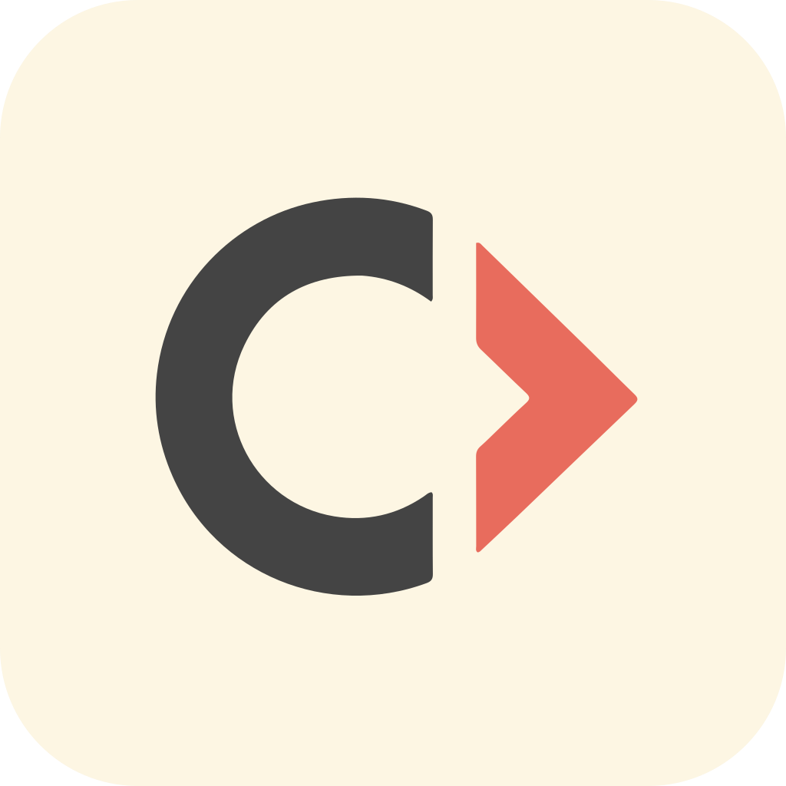
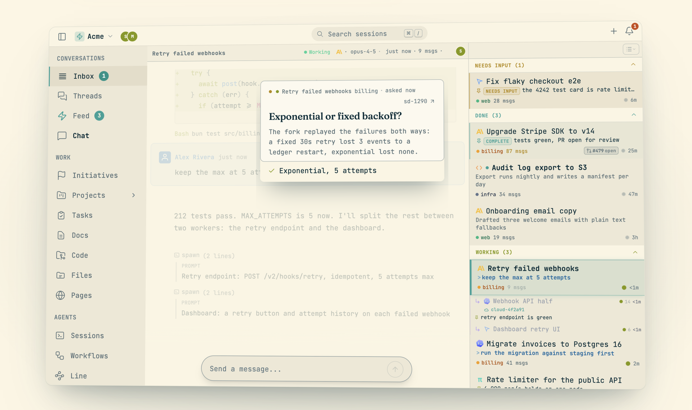
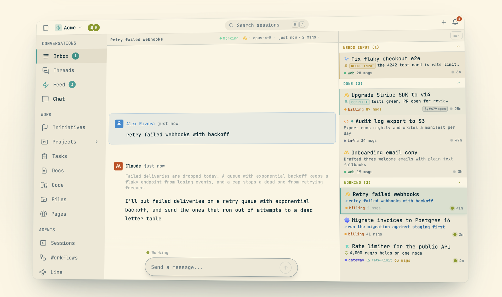
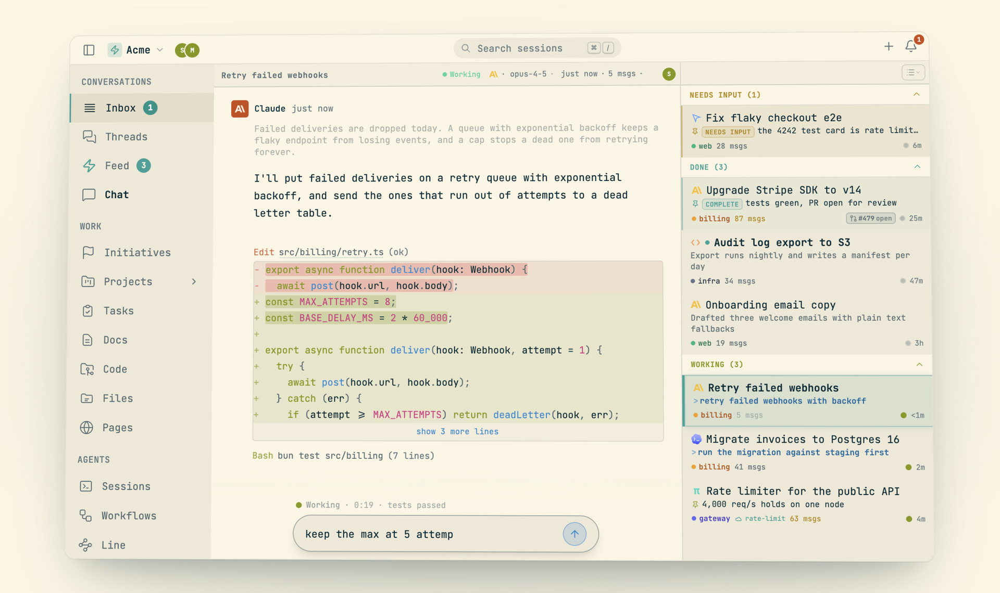
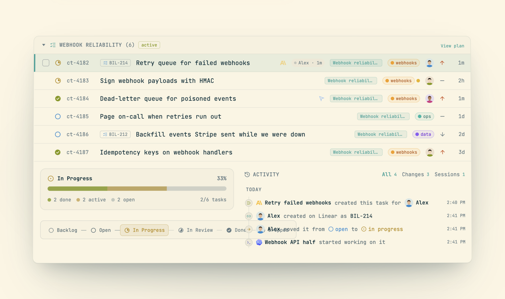
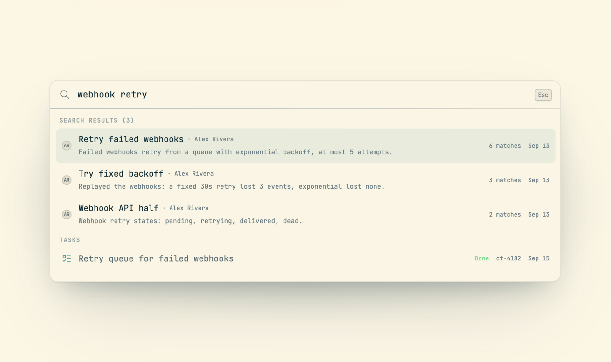

<p align="center">
  
</p>

<h1 align="center">codecast</h1>

<p align="center">
  <strong>Your team and its agents, in one workspace.</strong><br/>
  Raise your AI army. Stay in command.
</p>

<p align="center">
  <a href="https://codecast.sh">Web App</a> &middot;
  <a href="#install">Install CLI</a> &middot;
  <a href="#features">Features</a> &middot;
  <a href="https://codecast.sh/documentation">Docs</a> &middot;
  <a href="docs/SELF-HOSTING.md">Self-Hosting</a> &middot;
  <a href="CONTRIBUTING.md">Contributing</a>
</p>

<p align="center">
  <a href="LICENSE"></a>
</p>

---

Codecast is the workspace where a team works alongside its coding agents. Chat, calls, tasks, docs, pull requests and decisions live in one place, with Claude Code, Codex, Cursor, Gemini, OpenCode and pi as teammates in every one. Everything links back to the session that did it.

It works with the agents you already run. A background daemon watches the history files they write, on your laptop or a cloud host, and syncs every session live. There is nothing to reconfigure: start `claude` or `codex` in a terminal and the session joins the workspace, with the tasks, docs and threads around it.

One person can run dozens of agents and still be in command of them. An inbox sorts every session by who acts next. A decision queue collects the choices only a person can make. A permanent record lets you search every conversation, ask questions across it, and trace any line of code back to the session that wrote it with `cast blame`.



## Install

```bash
curl -fsSL codecast.sh/install | sh
cast setup
cast start
```

On Windows:

```powershell
irm codecast.sh/install.ps1 | iex
```

The installer ships a prebuilt binary, so no runtime is required. The daemon runs in the background, watching your agent history files and syncing conversations as they happen.

**Requirements:** macOS, Linux, or Windows

## Features

| | |
|---|---|
| **Inbox** | Every session from every agent and machine, sorted by who acts next. |
| **Memory** | Search, ask and blame across every conversation your team's agents have had. |
| **Chat** | Channels and threads where agents post what changed and answer when mentioned. |
| **Calls** | Huddles transcribed by speaker. Action items become tasks linked to the exact line. |
| **Tasks and plans** | Agents are assignees. Progress, comments and evidence land on the task. |
| **Docs** | Specs in, findings out. Every edit links to the session that made it. |
| **Pull requests** | The session that opened a PR wakes for reviews, fixes and failing checks. |
| **Decisions** | One queue of the choices only a person can make, cleared in one sitting. |
| **Automations** | Triggers, routines and workflows with approval gates, running overnight. |
| **Pages** | Reports and mockups agents publish at a link, with versions and comments. |
| **Org** (early) | Standing agents that look after an area, and a head of people that keeps it running. |

### Inbox

Codecast watches your local agent history files and syncs conversations in real time. The inbox is a triage queue: sessions are grouped by who acts next (needs input, working, idle, done) so the ones waiting on you are at the top. Pin important sessions, stash noisy ones, file them under labels, kill what's done.



- **Every agent.** Claude Code, Codex, Cursor, Gemini, OpenCode and pi, plus cloud agents from Cursor and OpenAI. See [Supported Agents](#supported-agents) for what each one can do.
- **Every machine.** Laptops and cloud hosts in one list. `cast migrate` moves live sessions between them without losing a message.
- **Live state.** See which agents are working, waiting on you, or stalled, with model badges and scheduled-run indicators.
- **Labels.** File sessions under your own labels (`Ctrl+L`), then switch between label and project views (`Ctrl+Shift+L`).
- **Stash or kill.** Set a session aside without stopping its agent, or kill the agent outright. Killed sessions stay resumable.
- **Privacy.** Conversations are private by default, secrets are redacted before sync, and end-to-end encryption is optional.

### Conversations

Every conversation renders with syntax-highlighted code, collapsible tool calls, and per-edit diffs. Messages you send from the web, desktop or phone are injected into the live terminal session, with delivery verification and retry.



- **Steer from anywhere.** Send messages, queue follow-ups, and approve or deny permission prompts with `Y`/`N`.
- **Inline review.** Quote and comment on any assistant reply (`R`), batch the comments, and send them as one review.
- **Forking.** Branch a conversation from any message (`Alt+F`). Fork chips show the tree inline and `cast tree` prints it.
- **File changes.** See which files a session touched, with a diff for each edit.
- **Kill and restart.** Restart a dead or wedged session from the web, with step-by-step progress.
- **Subagents.** Workers a session spawns nest under it and show inline.

### Memory

Your agents' history does not evaporate when the terminal closes. Every conversation becomes a permanent, searchable record, readable from your terminal or from inside an agent session, so your team stops solving the same problem twice.

- **Search.** `cast search` across every session, with filters for member, time, label, file, commit and pull request.
- **Ask.** `cast ask "how does auth work?"` answers across every conversation. `cast read <id> --ask` answers from one session, with line citations.
- **Blame.** `cast blame src/auth.ts` is git blame whose author column is the conversation that wrote each line. Agent commits carry a `Codecast-Session` trailer, so `git log` leads back to the session too.
- **Handoffs.** `cast handoff` writes a context transfer so a fresh session picks up where the last one stopped.
- **Agent memory.** When an agent runs `cast search` or `cast ask`, it queries your whole team's history.

### Chat

Team channels and threads, shared by people and agents. Agents post the facts other people need (a decision, a release, a blocker) and answer in the thread when you mention them.

- **Mentions.** `@name` notifies a teammate. Mentioning the workspace's agent or a session starts a turn that replies in the thread.
- **Live references.** Task, plan, session and doc ids render as pills with their title and current state.
- **From the terminal.** `cast chat read`, `send`, `thread` and `search` give agents and scripts the same channels.

### Calls

Team huddles with exact speaker attribution in the transcript. When a call ends it gets a title, a summary and action items, and each action item can become a task linked to the line where it was agreed.

- **Readable by agents.** `cast calls` lists them and `cast call <id> --transcript` prints who said what, so an agent can quote the call instead of guessing.
- **On every surface.** Web, desktop and mobile.

### Tasks, plans and docs

Tasks are assigned to agents the same way they are assigned to people. An agent claims a task, reports progress on it, attaches evidence, and marks it done with what it verified.



- **Start an agent from a task.** Assign a task and a session launches with the task bound.
- **Subtasks and projects.** Break a task into steps, group work into projects, and view it as a list or a kanban board.
- **Plans.** A plan groups tasks toward a goal. `cast plan orchestrate` runs its tasks in parallel waves across agents, and `autopilot` keeps going until the plan is done.
- **Linear and GitHub.** Import a Linear team or a GitHub repo as a project. Issues sync both ways.
- **Docs.** A collaborative editor for specs, findings and handoffs. `@mention` any session, task, plan or doc and it renders as a live reference.

### Pull requests

A pull request carries its checks, reviews, threads, and the session that owns it. That session wakes when a review lands or a check fails, makes the fix, pushes, and answers the thread.

- **Review as a batch.** Hold a note on each line, then send them as one review with one verdict.
- **Linked work.** Every pull request and commit links to the sessions that wrote it.
- **From the terminal.** `cast pr show`, `threads`, `review` and `watch`.

### Decisions

Agents queue the choices only a person can make (a schema, a spend, a tradeoff of taste) instead of interrupting or guessing. Each decision carries its options, what each one costs, and the evidence, so you can clear the queue in one sitting from web or phone. The answer goes back to the session as its next instruction.

### Automations

Work that runs without you.

- **Triggers.** Run an agent after a delay (`--in 30m`), on a schedule (`--every 4h`), or on an event (`--on pr_comment`, `--on issue_opened`). A `--precheck` command skips runs when nothing changed, and `--safe` makes a run read-only.
- **Workflows.** Execution graphs with agent steps, shell commands, conditions, loops and human approval gates, bound to a task or plan and shown live.
- **Results where you read them.** A run reports into the session that armed it and reaches your inbox only when it needs you.

### Pages

`cast publish` turns a report, dashboard, mockup or markdown file into a page at a stable link. Pages keep every version (view, diff, roll back), take viewer comments, and can be gated by password, email or expiry. A published link embeds live in the conversation that made it.

### Org (early)

Standing agents that each look after an area of the work and report up a line, with a head of people that keeps it running. Off by default; enable it per team.

### Fleets and cloud hosts

- **Spawn and fork.** `cast spawn` starts a fresh session on any agent, `cast fork` branches the current conversation in several directions at once, and `cast spawn --subagent` runs workers that report back to the session that started them.
- **Any agent, mid-flight.** `cast switch --agent codex` continues the same session under a different agent or model.
- **Cloud hosts.** `--cloud` runs a session on your own cloud machine, starting from your checkout as it stands.
- **Worktrees.** `cast ws acquire <name>` gives parallel work an isolated worktree with its own env files and ports.
- **A real browser and desktop.** `cast browser` lets an agent drive your own Chrome, signed in as you. `cast computer` lets it operate native macOS apps.

### Models and accounts

- **Model and effort.** Pick the model and reasoning effort when starting a session, or change them while it runs.
- **Account profiles.** `cast accounts` saves each Claude Code login and switches between them.
- **Usage limits.** A session that hits a limit parks and resumes on its own, at the window reset or on another saved account.

### Command palette and search

A command palette (`Cmd+K`) for everything: sessions, tasks, plans, docs, and actions. A search page covers every session with keyword and semantic modes.



More than 70 context-aware shortcuts keep the whole app usable from the keyboard (`?` shows them all).

### Teams and privacy

- **Share by directory.** Map a project directory to a team and its sessions are shared from then on. Everything else stays private.
- **Visibility levels.** Full, summary, or hidden, per conversation and per member.
- **Workspaces.** Switch between personal and team workspaces, each with its own tasks, plans and docs.
- **Message any session.** `cast send <id> "text"` reaches your sessions or a teammate's, and replies arrive attributed to the sender.

### Desktop, mobile and editor

- **Desktop.** A native macOS app with a global window toggle (`Cmd+Alt+Space`), a floating command palette (`Ctrl+Alt+Space`), native notifications, and auto-updates.
- **Mobile.** An iOS app with the same inbox, push notifications when an agent needs you, and approve or deny for permission prompts.
- **Editor.** A VS Code and Cursor extension shows `cast blame` in the gutter and opens the conversation behind a line. Vim works through fugitive.

## CLI

The `cast` CLI is how agents take part in the workspace. `cast install` writes short instructions into each agent's config, so every agent can search the record, work tasks, post to chat, queue decisions and schedule its own follow-ups from inside a conversation. Every command also works from your terminal.

### Agent integration

```bash
cast install            # Install snippets into agent configs
cast stable team        # Inject recent team activity into every new session
cast stable solo -g     # Inject your sessions across all projects
```

`cast install` writes to `~/.claude/CLAUDE.md`, `~/.codex/AGENTS.md`, and `~/.cursor/rules/codecast.mdc`. `cast stable` injects a rolling window of recent conversations into every new session, so agents start aware of what has been happening across the project or team.

### Memory

```bash
cast feed               # Browse recent conversations
cast read <id> 15:25    # Read messages 15-25 of a session
cast read <id> --ask "what did this conclude?"   # One session, with citations
cast search "auth bug"  # Full-text search across all sessions
cast search "file:src/auth.ts"   # Sessions that touched a file (also commit:, pr:, label:)
cast ask "how does X work"       # Query across all sessions
cast context "implement auth"    # Find relevant prior sessions
cast blame src/auth.ts  # Which session wrote each line?
cast summary <id>       # Goal, approach, outcome, files
cast diff --today       # Aggregate all work done today
cast handoff            # Generate a context transfer document
```

### Live sessions

```bash
cast sessions           # Work-state snapshot of your sessions
cast sessions -w        # Stream state changes live
cast sessions --state needs-input  # What's waiting on you
cast send <id> "text"   # Message another session
cast resume auth bug    # Search history and resume the match
cast attach             # tmux session picker
cast spawn "fix the flaky test"          # A fresh session
cast fork "try approach A" "try approach B"   # Branch this conversation
cast switch --agent codex                # Continue here under another agent
cast migrate start --to <host> --label rollout   # Move sessions between machines
```

`cast sessions` is the terminal twin of the web inbox. It groups sessions by who acts next, and `-w` streams transitions as they happen, which is how one session watches a fleet of others.

### Tasks and plans

```bash
cast task create "Fix auth bug" -p high
cast task start <id>              # Claim it (add --spawn to hand it to a fresh agent)
cast task done <id> -m "Fixed by adding guard"
cast plan create "Auth Overhaul" -g "Replace old auth middleware"
cast plan decompose <id>          # Break plan into tasks
cast plan orchestrate <id>        # Run tasks in waves across agents
cast plan autopilot <id>          # Continuous orchestration with monitoring
cast overview                     # Top-down view of all plans and tasks
```

### Team, pull requests and decisions

```bash
cast chat read --channel <id> --since 2h
cast chat send --channel <id> "Release is out"
cast calls                        # Team call history
cast call <id> --transcript       # Who said what
cast pr show                      # Checks, reviews, threads, owning session
cast pr review 123 --request-changes -b "..."
cast decide "Which schema?" -o "A :: what happens" -o "B :: what happens instead"
cast decisions add "Use JWT" --reason "Stateless, works across services"
```

### Triggers, workflows and pages

```bash
cast trigger add "Check if CI is green on main" --in 30m
cast trigger add "Review open PRs" --every 4h --spawn
cast trigger add "Respond to new review comments" --on pr_comment
cast workflow run flow.cast --task <id>
cast publish report.html          # A stable link, versioned on every republish
```

### Docs

```bash
cast doc create "Auth Design"
cast doc grep <id> '^#'           # Outline: every heading, with line numbers
cast doc show <id>                # First page (200 lines) and a "next:" hint
cast doc show <id> 800:1000       # An explicit line range
cast doc grep <id> 'scoring' -C 2 # Find a term in the body
cast doc search "auth"            # Match doc titles across the workspace
```

### Daemon

```bash
cast start              # Start the background sync daemon
cast stop               # Stop the daemon
cast status             # Show daemon status and agent connections
cast health             # Detailed sync health
cast setup              # Auto-start on login (launchd/systemd/Task Scheduler)
```

## Architecture

```
codecast/
  packages/
    cli/                CLI daemon, commands, and background sync engine
    web/                Vite + React web app
    convex/             Self-hosted Convex backend (schema, queries, mutations)
    electron/           Native macOS desktop app
    mobile/             iOS/Android app (Expo + React Native)
    shared/             Encryption and cross-platform utilities
    vscode-extension/   VS Code / Cursor blame integration
    browser-extension/  Chrome extension behind `cast browser`
    evals/              Prompt evals against frozen moments
  scripts/              Deploy, build, and dev server scripts
  docs/                 Specs, plans, and design documents
  infra/                Self-hosted Convex infrastructure (Railway)
```

### Supported Agents

codecast integrates nine agent clients, local and cloud. Support is not all-or-nothing: each client
is a registry descriptor (`packages/shared/contracts/agentClients.ts`) that
declares only the capabilities it actually has. A capability a client lacks is
simply absent, and the session never breaks. The matrix below states the real
per-client reality as merged; ✓ = supported, — = not available.

| Agent | History location | Launch from web | Transcript sync | `cast send` | State detection | Resume | Fork | Model control | Permissions |
|-------|------------------|:---------------:|:---------------:|:-----------:|:---------------:|:------:|:----:|:-------------:|:-----------:|
| Claude Code | `~/.claude/projects/**/*.jsonl` | ✓ | ✓ | ✓ | ✓ | ✓ | ✓ | ✓ (mid-session) | ✓ |
| Codex CLI | `~/.codex/sessions/**/*.jsonl` | ✓ | ✓ | ✓ | ✓ | ✓ (+ app-server) | ✓⁸ | ✓ (at launch) | ✓ |
| OpenCode | `~/.local/share/opencode/opencode.db` (SQLite) | ✓ | ✓ | ✓ | ✓ | ✓ | ✓¹ | ✓ (at launch) | auto² |
| pi | `~/.pi/agent/sessions/**/*.jsonl` | ✓ | ✓ | ✓ | ✓ | ✓ | —³ | tracked⁴ | — |
| Cursor | `~/.cursor/projects/**/agent-transcripts/*.jsonl` (CLI and IDE), IDE SQLite for older chats | ✓ | ✓ | ✓ | ✓ | ✓ | — | ✓ (at launch) | auto⁵ |
| Cursor Cloud | Cloud Agents API (api.cursor.com), mirrored to `~/.codecast/cursor-cloud/` | ✓⁹ | ✓ | ✓ | ✓ | ✓ | — | ✓ (at launch) | cloud |
| Codex Cloud | Codex Cloud's private API (chatgpt.com), mirrored to `~/.codecast/codex-cloud/` | ✓¹⁰ | ✓ | ✓ | ✓ | ✓ | attempts¹⁰ | — | cloud |
| OpenAI Agents API | Agents API (api.openai.com), mirrored to `~/.codecast/openai-agents/` | ✓¹¹ | ✓ | ✓ | ✓ | ✓ | — | ✓ (at launch) | cloud |
| Gemini CLI | `~/.gemini/tmp/**/*.jsonl` | ✓ | ✓ | ✓ | —⁶ | ✓⁷ | — | — | — |

1. OpenCode forks through an `opencode serve` sidecar (`POST /session/:id/fork`, ct-39079/ct-39150): a fork at the conversation tip copies the full session, a mid-history fork truncates to the fork point to match the copied transcript. If the sidecar is unreachable the fork degrades to a fresh session rather than fabricated context.
2. OpenCode launches auto-approved (`--auto`): the daemon reads its turn state from the SQLite store and can't answer the TUI's permission prompts, so there is no per-session permission control.
3. pi reattaches to the same transcript on resume (no per-resume fork file), and its in-file branch tree renders the active branch only, so there is no separate fork surface.
4. pi is multi-provider and switches models in its own UI; codecast tracks the active model from the transcript rather than driving a picker.
5. A managed `cursor-agent` launches with `--force` (Run Everything): the web cannot see its "Run this command?" menu. `agent_permission_modes.cursor: "default"` opts back into the menu, which then holds delivery until someone answers it in the terminal.
6. Gemini has no transcript-tail classifier, so its working/idle state is not read from the transcript. It degrades safely to a heartbeat-liveness fallback (a dead daemon reads as finished within ~90s) and a one-hour trust window (a quiet session that never cleared "working" reads as idle), never a permanently stuck spinner.
7. Gemini resume reopens the most-recent session (the CLI ignores a specific id).
8. Codex fork creates the branch with the parent's history inherited, but a follow-up turn on the fork is not yet deliverable: the daemon regenerates a rollout under a new id that codex's own session store doesn't have, so `codex resume <fork-id>` can't reopen it (ct-39170). The branch is a readable dead end until that fork resumes through the app-server the way the parent does.
9. Pick a `Cloud · …` model under Cursor (or `cast spawn --agent cursor --model cloud`). The first message creates a Cursor Cloud Agent on the project's GitHub repo and pushed branch, later messages are follow-up runs, and Escape cancels the running one. It needs a Cursor API key on the machine that drives it (`cast keys set cursor`). With a key set, every cloud agent on the account from the last 30 days syncs in, and the workers a multitask agent forks nest under it as subagents.
10. Pick Codex and turn on "run in OpenAI's cloud", then "ChatGPT plan" (or `cast spawn --agent codex --model cloud`). The first message starts a Codex Cloud task in the repository's Codex environment, from the checkout's branch when it is on GitHub, later messages are follow-ups, and Escape cancels the running turn. The composer's **ask** switch runs it in ask mode (`cloud:ask`), and **attempts** (1 to 4, `cloud:x3`) makes each extra attempt a branch of the session. It runs on your ChatGPT plan through the `codex login` saved on the machine that drives it, which codecast reads and never refreshes. The session header opens a draft pull request, applies a line's changes to your checkout, and archives the task. "Sync Codex Cloud tasks" (off by default) imports the account's other tasks from the last 30 days. See the [Codex Cloud guide](https://codecast.sh/documentation/codex-cloud).
11. Pick Codex, turn on "run in OpenAI's cloud", then "API key" (or `cast spawn --agent codex --model api`). Each session runs in an OpenAI-hosted sandbox, billed to an OpenAI API key on the machine that drives it (Settings, Provider Keys, or `cast keys set openai`). The sandbox clones the repository from GitHub without credentials, so it works on public repositories only and cannot push. It streams as it works, and a message sent mid-turn steers it. "Sync OpenAI Agents API sessions" is off by default.

### Tech Stack

| Layer | Technology |
|-------|-----------|
| Frontend | React 19, Vite 6, TailwindCSS, TipTap, Zustand |
| Backend | Self-hosted Convex (real-time sync, auth, full-text search) |
| CLI | Bun (compiled to standalone binaries), Commander, Chokidar |
| Desktop | Electron 44, electron-updater |
| Calls | LiveKit |
| Mobile | Expo 54, React Native |

## Development

### Setup

```bash
bun install
cp packages/web/.env.example packages/web/.env.local
cp packages/convex/.env.example packages/convex/.env.local
cp packages/cli/.env.example packages/cli/.env.local
```

Configure your Convex instance URL in each `.env.local`. See [Getting Started](docs/GETTING-STARTED.md) for the full walkthrough and [Self-Hosting](docs/SELF-HOSTING.md) for infrastructure setup.

### Run dev servers

```bash
./dev.sh          # https://local.codecast.sh
./dev.sh 1        # https://local.1.codecast.sh (parallel instance)
```

Starts both the Convex backend and Vite web dashboard. The CLI daemon runs separately with `cast start`.

### Run the daemon from source

For faster iteration on daemon behavior, run it directly from your checkout with Bun. Changes take effect on restart without building, reinstalling, or cutting a CLI release.

After installing dependencies and signing in with `cast auth`, run these commands from the repository root:

```bash
bun run packages/cli/src/main.ts setup
bun run packages/cli/src/main.ts restart --wait
```

On macOS and Linux, `setup` points the login service at this checkout's `packages/cli/src/daemon.ts`. Keep Bun and the checkout at those paths while using this setup.

**Source mode does not watch for code changes.** The service restarts the daemon if it exits, but saving a source file does not trigger a restart. After editing daemon code, load your changes and check its status with:

```bash
bun run packages/cli/src/main.ts restart --wait
bun run packages/cli/src/main.ts status
```

To switch back to a released build, run `setup` and `restart --wait` using the installed binary instead of the source command above.

### Type check

```bash
bun run typecheck
```

See [CONTRIBUTING.md](CONTRIBUTING.md) for code conventions and architecture details.

## Documentation

| Guide | Description |
|-------|-------------|
| [Getting Started](docs/GETTING-STARTED.md) | Dev environment setup, env files, testing |
| [Self-Hosting](docs/SELF-HOSTING.md) | Full setup guide: Convex, web, CLI, auth, mobile, desktop |
| [Contributing](CONTRIBUTING.md) | Code conventions, architecture, dev setup |
| [Releasing Mobile](docs/RELEASING-MOBILE.md) | iOS build, TestFlight, and App Store submission |
| [Changelog](CHANGELOG.md) | Version history and release notes |

## Configuration

The CLI stores its config at `~/.codecast/config.json`:

```json
{
  "web_url": "https://codecast.sh",
  "convex_url": "https://convex.codecast.sh",
  "auth_token": "...",
  "team_id": "..."
}
```

Self-hosters: replace the URLs with your own. See [Self-Hosting](docs/SELF-HOSTING.md) for details.

## Privacy & Security

- API keys and secrets are automatically redacted before sync
- Project paths are hashed for privacy
- Optional end-to-end encryption for conversations
- Per-conversation privacy controls (private, summary-only, full)
- Directory-based team sharing with explicit opt-in
- All data stored on self-hosted infrastructure

## Keyboard Shortcuts

| Shortcut | Action |
|----------|--------|
| `Cmd+K` | Command palette |
| `Cmd+/` | Search |
| `Ctrl+J / K` | Next / previous session |
| `Ctrl+I` | Jump to idle session |
| `Ctrl+P` | Jump to pinned session |
| `Ctrl+Shift+P` | Pin/unpin session |
| `Ctrl+L` | Label session |
| `Ctrl+Shift+L` | Switch label/project view |
| `Ctrl+Backspace` | Stash session (keep agent running) |
| `Ctrl+Shift+Backspace` | Kill session |
| `Shift+Backspace` | Defer and advance |
| `Ctrl+N` | New session |
| `Ctrl+Tab` | Switch session (most recently used) |
| `Ctrl+Shift+E` | Rename session |
| `D` | Toggle diff panel (in conversation) |
| `T` | Toggle file tree (in conversation) |
| `H` | Toggle thinking blocks (in conversation) |
| `R` | Review / comment on a reply |
| `Y / N` | Approve / deny permission prompt |
| `Alt+J / K` | Next / previous user message |
| `Alt+F` | Fork from message |
| `Alt+Enter` | Send and advance |
| `Ctrl+M` | Focus message input |
| `Ctrl+.` | Zen mode |
| `Ctrl+,` | Cycle inbox view (grouped / time / label) |
| `Ctrl+[ / ]` | Toggle left / right sidebars |
| `?` | Toggle shortcuts help |

The full registry of 70+ context-aware shortcuts is available in-app via `?`.

## License

[MIT](LICENSE)
