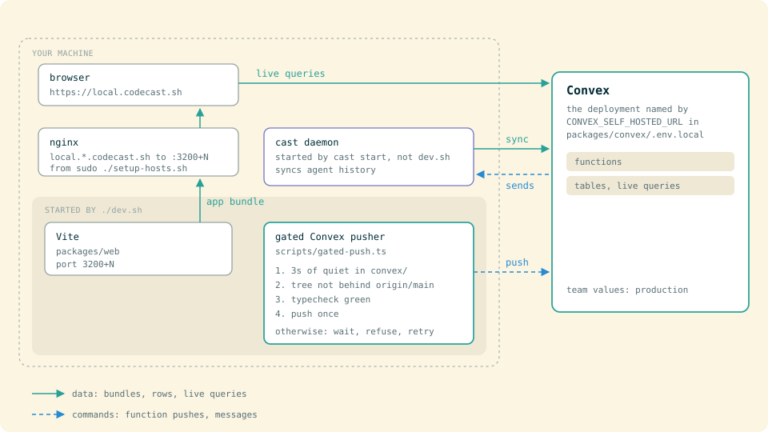

# Getting Started with Codecast Development

## What You're Setting Up

A CLI daemon watches the history files coding agents write (Claude Code, Codex, Cursor, Gemini, OpenCode, pi, Grok, Muse Spark) and syncs them to a Convex backend. The web, desktop and mobile apps read from Convex live, and messages sent from them travel back through the daemon into the agent's terminal.



| Package | What it does |
|---------|-------------|
| `packages/cli` | `cast` CLI and daemon: watches sessions, syncs to Convex, injects messages |
| `packages/convex` | Backend: schema, queries, mutations, auth, HTTP routes |
| `packages/web` | React + Vite web app |
| `packages/shared` | Contracts and utilities shared by every package (agent registry, render, diff) |
| `packages/electron` | Desktop app (Electron wrapper around the web app) |
| `packages/mobile` | iOS app (Expo / React Native) |
| `packages/browser-extension` | Chrome extension behind `cast browser` |
| `packages/vscode-extension` | VS Code / Cursor extension for `cast blame` |
| `packages/evals` | Prompt evals against frozen moments (`./evals`) |

---

## 1. Prerequisites

```bash
# Bun (package manager + runtime)
curl -fsSL https://bun.sh/install | bash

# Node.js 20+ (required by Convex CLI)
brew install node
```

## 2. Clone and Install

```bash
git clone git@github.com:ashot/codecast.git
cd codecast
bun install
```

## 3. Create Environment Files

Run these commands from the repo root. Each package also has a `.env.example` listing every variable it reads. No repo-root `.env.local` is needed; if a Convex CLI run leaves one with `CONVEX_DEPLOYMENT=anonymous`, `dev.sh` and `deploy.sh` both work around it.

### `packages/convex/.env.local`

```bash
cat > packages/convex/.env.local << 'EOF'
CONVEX_SELF_HOSTED_URL=https://convex.codecast.sh
CONVEX_SELF_HOSTED_ADMIN_KEY=<get-from-team-lead>
CONVEX_URL=https://convex.codecast.sh
CONVEX_SITE_URL=https://convex.codecast.sh
EOF
```

These values point at the production deployment. With them, `./dev.sh` pushes every Convex change you save to production through the gated pusher (step 5). To experiment without touching prod, point them at your own deployment (see [Self-Hosting](SELF-HOSTING.md)).

### `packages/web/.env.local`

```bash
cat > packages/web/.env.local << 'EOF'
VITE_CONVEX_URL=https://convex.codecast.sh
VITE_SENTRY_DSN=<get-from-team-lead>
VITE_POSTHOG_KEY=<get-from-team-lead>
VITE_POSTHOG_HOST=https://us.i.posthog.com
PORT=3000
EOF
```

### `packages/cli/.env.local`

```bash
cat > packages/cli/.env.local << 'EOF'
CONVEX_URL=https://convex.codecast.sh
CODE_CHAT_SYNC_WEB_URL=https://codecast.sh
EOF
```

### Optional: `packages/mobile/.env.local`

Only if working on the iOS app:

```bash
cat > packages/mobile/.env.local << 'EOF'
EXPO_PUBLIC_CONVEX_URL=https://convex.codecast.sh
EXPO_PUBLIC_POSTHOG_KEY=<get-from-team-lead>
EXPO_PUBLIC_POSTHOG_HOST=https://us.i.posthog.com
EOF
```

### Optional: desktop app against your local web

The desktop app reads no `.env` file. Pass the origin on the command line; `bun run dev` in `packages/electron` already does (`CODECAST_URL=https://local.codecast.sh electron .`). The origin must be https: the http one redirects and lands on a different localStorage origin.

A from-source run (`electron .`) also opens a Chrome DevTools Protocol port on `127.0.0.1:9333` so `cast app` and the perf harness can drive it. Set `CODECAST_CDP_PORT` to move it, or to open one on a packaged build.

## 4. Set Up Local Domains

```bash
sudo ./setup-hosts.sh
```

This adds `local.codecast.sh` (and `local.1.codecast.sh`, `local.2.codecast.sh`) to `/etc/hosts` and installs an nginx proxy. Skip this if you're fine using `http://localhost:3200`.

## 5. Start Everything

```bash
./dev.sh
```

This starts Vite on port 3200 and the Convex pusher (`packages/convex/scripts/gated-push.ts`), with a watchdog that restarts either if it crashes. The pusher waits for 3 seconds of quiet in `packages/convex/convex/`, runs the whole-program typecheck, then pushes once. It refuses to start while the tree is behind origin/main, because a push from a stale tree deletes newer functions from the deployment; `dev.sh` prints the pull instruction and starts the pusher once you pull. Open **https://local.codecast.sh** (http redirects to https) or `http://localhost:3200`.

`Ctrl+C` to stop. Run `./dev.sh` again to restart; it cleans up its own leftovers.

### Multi-instance

```bash
./dev.sh 0    # port 3200 → local.codecast.sh
./dev.sh 1    # port 3201 → local.1.codecast.sh
./dev.sh 2    # port 3202 → local.2.codecast.sh
```

### Running packages separately

```bash
cd packages/web && bun run dev       # Vite dev server (HMR) on vite's default port
cd packages/cli && bun run dev       # the cast CLI from source (pass a command, e.g. `bun run dev status`)
```

Leave the Convex pusher to `dev.sh`, which checks the tree is fresh before starting it. To ship Convex changes without `dev.sh`, run `packages/convex/deploy.sh`; never a raw `npx convex deploy` or `convex dev`.

## 6. Convex Application Env Vars

The `.env.local` file from step 3 handles deployment credentials. The application env vars below are already set on the production Convex deployment. You only need to run these when setting up a new instance; [Self-Hosting](SELF-HOSTING.md) lists every variable:

```bash
cd packages/convex
npx convex env set SITE_URL "https://codecast.sh"
npx convex env set RESEND_API_KEY "<get-from-team-lead>"
npx convex env set ANTHROPIC_API_KEY "<get-from-team-lead>"
npx convex env set AUTH_GITHUB_ID "<get-from-team-lead>"
npx convex env set AUTH_GITHUB_SECRET "<get-from-team-lead>"
npx convex env set AUTH_APPLE_ID "sh.codecast.web"
npx convex env set AUTH_APPLE_SECRET "<get-from-team-lead>"
npx convex env set GITHUB_APP_ID "<get-from-team-lead>"
npx convex env set GITHUB_APP_PRIVATE_KEY "<get-from-team-lead>"
npx convex env set GITHUB_APP_WEBHOOK_SECRET "<get-from-team-lead>"
npx convex env set GITHUB_APP_SLUG "codecast-sh"
npx convex env set GITHUB_APP_CLIENT_ID "<get-from-team-lead>"
npx convex env set GITHUB_APP_CLIENT_SECRET "<get-from-team-lead>"
npx convex env set GITHUB_WEBHOOK_SECRET "<get-from-team-lead>"
```

The Convex dashboard for the self-hosted instance runs on the Convex host: `ssh -N -L 6791:127.0.0.1:6791 pg-union`, then open `http://localhost:6791`.

(`npx convex dashboard` does not work with self-hosted Convex.)

## 7. CLI Setup

The quickest route is the released binary (`curl -fsSL codecast.sh/install | sh`). To work on the daemon, run it from your checkout instead; the README's "Run the daemon from source" section has the steps. To build a binary yourself:

```bash
cd packages/cli
bun run build:binary               # produces ./codecast
cp codecast ~/.local/bin/codecast
ln -sf ~/.local/bin/codecast ~/.local/bin/cast

cast config convex_url https://convex.codecast.sh   # only for a backend other than codecast.sh's
cast config web_url https://codecast.sh
cast auth                           # authenticate via browser
cast start                          # start the daemon
cast setup                          # start it on login (launchd, systemd, or Task Scheduler under WSL)
```

The CLI config lives at `~/.codecast/config.json`:

```json
{
  "web_url": "https://codecast.sh",
  "convex_url": "https://convex.codecast.sh",
  "auth_token": "set-by-cast-auth"
}
```

## 8. Testing

### Unit and integration tests

Every package runs `bun test`. Run the test file you changed (`bun test <file>`) rather than a whole suite; whole-suite runs are the load a busy machine cannot absorb. CI (`.github/workflows/ci.yml`) runs typecheck, lint and the convex, web, cli, shared, platform, mobile and electron suites, plus the cli messaging e2e against a real tmux, on every pull request and every push to `main`.

### End-to-end proof

`cast doctor` proves the sync loop live: transcript to server, server to daemon to tmux inject, echo back. Exit code 0 means the whole loop works.

### Driving the app itself: `cast app`

`cast app` drives the running web or desktop app the way a user does, on top of `cast browser`. `cast browser` knows pages; `cast app` knows codecast: which surface is which, what "signed in" and "settled" mean, which build is loaded, and how to become a known account for a run. Every verb attaches to the page over the Chrome DevTools Protocol and reads the app's own handles (`window.__CODECAST_BUILD`, `__syncActivity`, `__syncReplication`, `__navLog`, and `__inboxStore`), so nothing scrapes the DOM for state.

```bash
cast app doctor                     # origin, build, account, daemon owner, sync role, settled; exit 1 if not drivable
cast app surfaces                   # the surfaces goto accepts and sweep walks
cast app goto tasks                 # a surface by name; confirms where the app landed
cast app goto jx7abcd               # a conversation by short id
cast app wait-settle                # catch-up quiet, outbox empty
cast app sweep --json               # every surface: rendered, no crash, no errors, no redirect
cast app as-user demo@example.com   # sign the page in as a named account (--restore puts yours back)
cast app shot                       # screenshot into the conversation
cast app --desktop doctor           # the same against the desktop app
```

The loop is doctor, goto, wait-settle, then prove with `cast browser` (snapshot, get text, shot) or `eval`.

The target is this session's tab, in whichever browser `cast browser` would use: your own Chrome through the extension by default, even before pairing. A missing or disconnected extension reports a recovery step; it never starts the separate agent Chrome. Ordinary commands do not accept `--clone`, and old session selections cannot change the default. Separate Chrome is available only through the advanced browser command, for work the human explicitly authorizes. The origin is local dev when vite answers on port 3200 and production otherwise (`--origin <url>` or `CAST_APP_ORIGIN` overrides). `--desktop` drives the desktop app over its debugging port instead: a from-source run opens `127.0.0.1:9333`, a packaged build only with `CODECAST_CDP_PORT` set. Any Electron app can own that port (the mail app takes 9333 when it starts first), so doctor refuses a port whose pages are not codecast; run codecast with `CODECAST_CDP_PORT=<free port>` and pass the same variable to `cast app`.

Install [Codecast for Chrome](https://chromewebstore.google.com/detail/codecast/odfpgkdaibmjhhnbndgbjlhdbciciifd), then run `cast browser extension setup` in a terminal on that same computer and click **Pair** in Chrome. `cast browser extension status` confirms the connection. Chrome keeps the store extension up to date. See the [browser guide](https://codecast.sh/documentation/browser) for other Chrome profiles and migrating from an unpacked copy.

`cast browser status` and `tabs` inspect without creating tabs. Page actions require an existing page; `open <url>` creates that URL directly in a background tab, with no blank setup tab.

`goto` and `sweep` navigate in-app (pushState, the way a click routes) so surfaces switch in milliseconds and the store stays warm. The tab shell re-asserts its own URL when the destination is outside it (the settings pages, for one), so a bounced navigation falls back to a full document load; `--reload` forces that for every step. On local dev a full load is a vite transform pass and can take 30 seconds or more.

`as-user` mints a real token pair through `packages/convex/run.sh verification:mintSession` (admin key, so only from the codecast checkout), parks every app window on a blank page, swaps the pair into localStorage and reloads. Parking matters: any live document on the origin holds an auth client that rotates a fresh refresh token the moment it sees it, and the reloaded page then boots signed out. The identity that was there is saved on the page; `as-user --restore` puts it back. It never changes the signed-in account in your own Chrome; use `--desktop` for an authorized account change in the desktop app. The user must own this machine's daemon for daemon-backed surfaces (terminal, vault, device commands) to read as online; doctor says when they do not.

The surface list lives in `@codecast/shared/contracts/appSurfaces.ts`. A test in `routes.manifest.test.ts` fails when a param-free signed-in route is missing from it, or when it names a route the router no longer serves.

### Convex test scripts

Some test scripts hit the Convex API directly. Get a token from `cast auth` or the Convex dashboard:

```bash
CONVEX_API_TOKEN=your-token bun packages/convex/test-pending-messages.ts
```

### Typecheck

```bash
cast check                          # cli, web and convex (listed in .codecast/check.toml)
cast check web                      # one program
```

`cast check` keeps one `tsc --watch` per program and answers in seconds after the first pass. Don't run `tsc --noEmit` yourself: each fresh run rebuilds the whole program, and many at once push the machine into swap.

---

## Runtime Flags

`cast status` shows the daemon's WebSocket state separately from a live backend check:
network interfaces, DNS resolution time, an authenticated API request, and its round-trip
latency (including server processing). Requests taking at least one second are marked slow.
DNS and API checks run concurrently with a three-second deadline and no retries. Failed
checks distinguish authentication rejection, server errors, timeouts, and connection failures.
Saved daemon state older than two minutes is shown as unknown.

Use `cast status --no-network` for local diagnostics without live probes, or
`cast status --json` for machine-readable output. Neither mode prints the saved auth token.
`cast doctor` runs the fuller sync self-test.

These aren't in `.env` files; set them in your shell when needed:

```bash
# Debugging
DEBUG=1 cast start                  # verbose daemon logs
DEBUG_CLI=1 cast status             # verbose CLI command output
ASK_DEBUG=1 cast ask "query"        # debug AI search

# Pause sync
CODECAST_PAUSED=1 cast start        # start daemon but don't sync
# CODE_CHAT_SYNC_PAUSED=1           # legacy name, same effect

# Override working directory
CODECAST_CWD=/path/to/project cast start

# Bind session to task/plan
CODECAST_TASK_ID=ct-xxx cast start
CODECAST_PLAN_ID=pl-xxx cast start

# Disable colored output
NO_COLOR=1 cast status

# Parallel agents (used by init.sh for port allocation)
AGENT_RESOURCE_INDEX=1 ./init.sh    # Web 3100, Convex 3101
```

For parallel work in isolated worktrees, `cast ws acquire <name>` is the better tool: it copies env files and allocates ports from `.codecast/workspace.toml`.

These are set automatically by coding agents (don't set manually):

```bash
CLAUDE_CODE_SESSION_ID=...          # set by Claude Code
CODEX_SESSION_ID=...                # set by Codex CLI
CODECAST_RESTART=1                  # set when daemon auto-restarts
```

The daemon also reads these OS-level vars (you don't set them):

```bash
HOME                                # ~/.codecast, ~/.claude, etc.
PATH                                # enriched with /opt/homebrew/bin for spawned processes
APPDATA                             # Windows: Cursor config path
XPC_SERVICE_NAME                    # macOS: detects if running as launchd service
TMUX / TMUX_PANE                    # tmux session/pane detection
```

---

## CLI Binary Distribution

Releases are cut from CI (next section). The laptop path, `packages/cli/scripts/deploy.sh`, is only needed to publish the npm package and Homebrew tap mirrors. It reads R2 credentials from `packages/cli/.env.deploy`:

```bash
AWS_ACCESS_KEY_ID=<s3-access-key>
AWS_SECRET_ACCESS_KEY=<s3-secret-key>
R2_ENDPOINT=https://<account>.r2.cloudflarestorage.com
```

Then `cd packages/cli && ./scripts/deploy.sh`.

### Cut a release from CI (no local certificate)

The macOS binaries are signed with the Developer ID certificate
(`Developer ID Application: Ashot Petrosian (WRG9THCK9Q)`). The certificate and
its passphrase live in two repo secrets, `MACOS_SIGN_CERT_P12` and
`MACOS_SIGN_CERT_PASSPHRASE`, so releases do not need the certificate in a
personal keychain. To cut a release:

```bash
gh workflow run cut-cli-release.yml -R codecast-sh/codecast
```

The workflow builds all five binaries on a macOS runner, signs the two darwin
binaries, uploads the staging objects to R2, and dispatches "Finalize
pre-uploaded CLI release". Finalize validates everything, publishes the
immutable R2 objects and `latest.json`, commits the version bump, tags, and
creates the GitHub release. Pass `-f dry_run=true` to build and sign without
publishing anything.

The CI path does not publish the npm package or the Homebrew tap. Those are
non-fatal mirrors that `deploy.sh` publishes from a laptop. To rotate the
certificate: export a fresh `.p12` from Keychain Access and replace both
secrets.

---

## Convex Auto-Set Vars

These appear in code but are set by the Convex runtime or Railway infrastructure, not by you:

```bash
CONVEX_SITE_URL        # auth.config.ts: auth provider domain, set by Convex
CONVEX_CLOUD_ORIGIN    # Railway env var on convex-backend service
CONVEX_CLOUD_URL       # alias for CONVEX_CLOUD_ORIGIN
```

---

## Scripts

| Script | What it does |
|--------|-------------|
| `./dev.sh` | Start Vite and the gated Convex pusher, with a watchdog |
| `./dev.sh N` | Multi-instance (port 3200+N) |
| `./init.sh` | First-time setup (install, env files, smoke test) |
| `sudo ./setup-hosts.sh` | Add local domains to `/etc/hosts`, install nginx |
| `./check.sh` | Quick environment health check |
| `packages/convex/deploy.sh` | The only way to deploy Convex: refuses a tree behind origin/main |
| `./scripts/deploy-all.sh` | Full release in order: Convex, push (Railway builds web), CLI cut in CI, mobile OTA, desktop when `packages/electron` changed, then waits for Railway |
| `scripts/vendor-platform.sh` | Refresh the `platform/packages/` mirror of `~/src/platform` (`--check` reports drift) |
| `./scripts/backup-convex.sh` | Backup Convex data (set `BACKUP_DIR`, `RETENTION_DAYS` to override defaults) |

## Troubleshooting

**`dev.sh` says hostname not in `/etc/hosts`.** Run `sudo ./setup-hosts.sh`.

**Convex functions not updating.** Check the `dev.sh` log. The pusher refuses a tree behind origin/main (pull with `git pull --rebase`) and skips a push while the typecheck fails, so a save that lands during a failing pass can be skipped. `packages/convex/deploy.sh` pushes explicitly.

**Port already in use.** `dev.sh` cleans up after itself, so run it again. Or: `lsof -ti :3200 | xargs kill`.

**CLI can't connect.** Check `~/.codecast/config.json`, try `curl https://convex.codecast.sh`, re-auth with `cast auth`.

**Auth callback fails.** `SITE_URL` on the Convex deployment must match your web app URL exactly (with protocol, no trailing slash).

**`npx convex dashboard` doesn't work.** Use the dashboard on the Convex host: `ssh -N -L 6791:127.0.0.1:6791 pg-union` then open `http://localhost:6791` directly. Self-hosted Convex doesn't support the CLI dashboard command.
