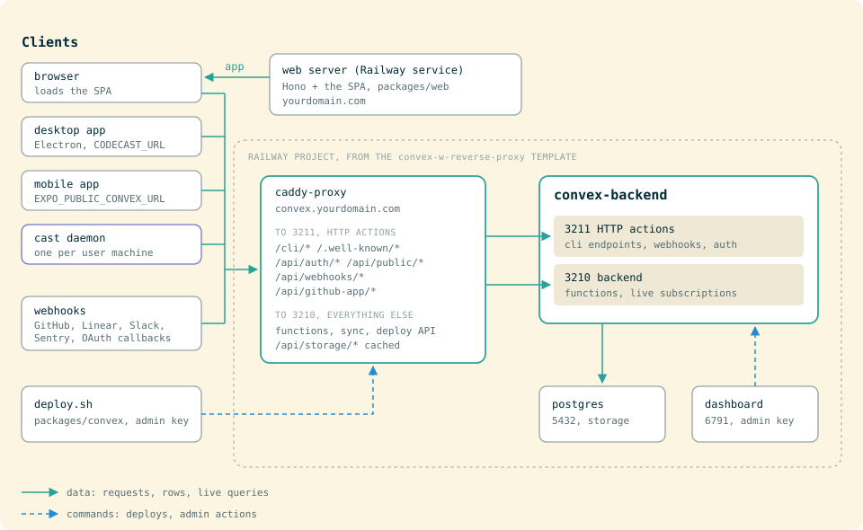

# Self-Hosting Codecast

This guide walks through setting up a complete self-hosted Codecast instance from scratch. The hosted version at [codecast.sh](https://codecast.sh) handles all of this for you.

**Time estimate:** ~1 hour for the core setup (Convex + web + CLI), longer if you want mobile/desktop apps.

## Architecture



| Component | Purpose | Required |
|-----------|---------|----------|
| Convex Backend | Real-time database, auth, serverless functions | Yes |
| Web Dashboard | React SPA + SSR server | Yes |
| CLI Daemon | Watches agent sessions, syncs to Convex | Yes (per user) |
| Desktop App | Native macOS wrapper with global shortcuts | Optional |
| Mobile App | iOS app for monitoring on the go | Optional |

## Prerequisites

- [Bun](https://bun.sh) 1.3+ (package manager and runtime; the repo pins `bun@1.3.13`)
- [Railway](https://railway.app) account (or another hosting platform)
- A domain name (e.g., `codecast.yourdomain.com`)
- [Resend](https://resend.com) account (for auth emails)

---

## Step 1: Deploy Convex Backend

Codecast uses self-hosted Convex for its real-time database. The setup runs four services on Railway.

### 1a. Create the Railway project

Click the one-click deploy template:

**https://railway.com/deploy/convex-w-reverse-proxy**

This creates a Railway project with four services:

| Service | Port | Purpose |
|---------|------|---------|
| `caddy-proxy` | 80 (public) | HTTPS reverse proxy, single entry point |
| `convex-backend` | 3210 + 3211 (internal) | Database engine + HTTP actions |
| `convex-dashboard` | 6791 (internal) | Admin dashboard UI |
| `postgres` | 5432 (internal) | PostgreSQL storage |

### 1b. Replace the reverse proxy

The default Caddy proxy only routes `/.well-known/*` and `/api/auth/*`. Codecast also needs `/api/github-app/*`, `/api/webhooks/*`, `/api/public/*` and `/cli/*` routed to HTTP actions.

Build and push the custom proxy from the repo:

```bash
cd infra/convex-proxy
docker build -t your-registry/codecast-convex-proxy .
docker push your-registry/codecast-convex-proxy
```

Then update the Railway Caddy service to use your image. The custom Caddyfile routes:

| Path | Destination | Purpose |
|------|-------------|---------|
| `/.well-known/*` | HTTP actions (3211) | JWKS for JWT validation |
| `/api/auth/*` | HTTP actions (3211) | OAuth callbacks |
| `/api/github-app/*` | HTTP actions (3211) | GitHub App install/callback |
| `/api/webhooks/*` | HTTP actions (3211) | GitHub, Linear, Slack and Sentry webhooks; OAuth connector callbacks |
| `/api/public/*` | HTTP actions (3211) | Public repository pages read without an account |
| `/cli/*` | HTTP actions (3211) | Every CLI and daemon endpoint (auth exchange, sync, search, tasks) |
| `/api/storage/*` | Backend (3210) | Stored files, served with a long-lived public `Cache-Control` |
| Everything else | Backend (3210) | Queries, mutations, subscriptions, the deploy API |

The proxy reads its two upstreams from `CONVEX_SITE_UPSTREAM` (port 3211) and `CONVEX_BACKEND_UPSTREAM` (port 3210); set both on the Caddy service.

### 1c. Get the admin key

After the first deployment, check the `convex-backend` deploy logs for a line like:

```
Admin key: codecast|0197af29e398027e9d7f...
```

Copy this key; every Convex CLI command needs it.

### 1d. Add a custom domain

On the Railway `caddy-proxy` service:
1. Add a custom domain: `convex.yourdomain.com`
2. Create a CNAME DNS record: `convex.yourdomain.com` -> `<railway-assigned-domain>`

### 1e. Set backend environment variables

On the Railway `convex-backend` service, add these environment variables:

```bash
# Tell the backend its own URL
CONVEX_CLOUD_ORIGIN=https://convex.yourdomain.com
CONVEX_SITE_ORIGIN=https://convex.yourdomain.com
```

### 1f. Deploy Convex functions

```bash
cd packages/convex
cp .env.example .env.local
```

Edit `.env.local`:
```bash
CONVEX_SELF_HOSTED_URL=https://convex.yourdomain.com
CONVEX_SELF_HOSTED_ADMIN_KEY=codecast|your-admin-key-from-step-1c
```

Deploy:
```bash
packages/convex/deploy.sh
```

Always deploy through `deploy.sh`, never a raw `npx convex deploy`. A deploy pushes the whole `convex/` tree as one snapshot, so a push from a checkout that is behind your `origin/main` deletes every newer function from the deployment. `deploy.sh` fetches origin and refuses such a tree, serializes overlapping deploys, and moves a repo-root `.env.local` with a `CONVEX_DEPLOYMENT=` pointer aside so it cannot redirect the CLI.

### 1g. Set application environment variables

These are set on the Convex deployment (not the Railway service), either via `npx convex env set` or the Convex dashboard:

```bash
# Required
npx convex env set SITE_URL "https://yourdomain.com"
npx convex env set RESEND_API_KEY "re_your_resend_key"

# Required for GitHub login
npx convex env set AUTH_GITHUB_ID "your_github_oauth_client_id"
npx convex env set AUTH_GITHUB_SECRET "your_github_oauth_client_secret"

# Required for Apple login (optional provider)
npx convex env set AUTH_APPLE_ID "your_apple_client_id"
npx convex env set AUTH_APPLE_SECRET "your_apple_jwt_secret"

# AI features (optional but recommended)
npx convex env set ANTHROPIC_API_KEY "sk-ant-..."

# Semantic search embeddings (optional)
npx convex env set VOYAGE_API_KEY "voyage-..."
# OR
npx convex env set OPENAI_API_KEY "sk-..."

# GitHub App for PR integration (optional, see Step 7)
npx convex env set GITHUB_APP_ID "123456"
npx convex env set GITHUB_APP_PRIVATE_KEY "base64-encoded-pem"
npx convex env set GITHUB_APP_WEBHOOK_SECRET "your-webhook-secret"
```

### 1h. Set up admin access

After creating your account, grant yourself admin:

```bash
npx convex run migrations:setStaff '{"email": "you@yourdomain.com", "staff": true}'
```

This enables the admin dashboard (daemon logs, user management, system commands). `setStaff` is an internal mutation, so it runs only with the admin key in `packages/convex/.env.local`.

---

## Step 2: Deploy Web Dashboard

The web app is a Vite + React SPA served by a small Hono server (`packages/web/server/index.ts`).

### 2a. Configure environment

```bash
cd packages/web
cp .env.example .env.local
```

Edit `.env.local`:
```bash
VITE_CONVEX_URL=https://convex.yourdomain.com
PORT=3000
```

### 2b. Build and run locally

```bash
bun install
bun run build
bun run start
```

The server runs on port 3000. It serves the SPA with server-side meta tags for link previews and bot crawlers.

### 2c. Deploy to Railway

Create a new Railway service from your repo. Railway will auto-detect the build:

**Build command:**
```bash
bun install --frozen-lockfile && cd packages/convex && bun run build && cd ../web && bun run build
```

**Start command:**
```bash
cd packages/web && bun run start
```

Or use the `Procfile` at the repo root which already defines:
```
web: cd packages/web && bun run start
```

Add a custom domain (e.g., `yourdomain.com`) to this service.

### 2d. Verify

Visit `https://yourdomain.com`. You should see the login page. Create an account with email/password or GitHub OAuth.

---

## Step 3: Authentication Setup

Codecast supports three auth providers. Email + password works out of the box with Resend. GitHub and Apple are optional. The provider setup is shared code in `@platform/auth/convex` (vendored under `platform/packages/`); `packages/convex/convex/auth.ts` holds only codecast's settings.

### Email + Password (with Resend)

1. Create a [Resend](https://resend.com) account
2. Add and verify your sending domain (e.g., `yourdomain.com`)
3. Create an API key
4. Set `RESEND_API_KEY` on your Convex deployment

**Important:** Every email (sign-in codes, password reset, welcome) is sent from the codecast brand's sender address: `packages/convex/convex/emails/send.ts` builds it with `senderAddress(BRAND)` from `@platform/email`, with `BRAND` defined in `emails/render.ts`. Point that brand at a domain you have verified in Resend, or sends will fail.

### GitHub OAuth

1. Go to [GitHub Developer Settings](https://github.com/settings/developers) > OAuth Apps > New OAuth App
2. Set:
   - **Homepage URL:** `https://yourdomain.com`
   - **Authorization callback URL:** `https://convex.yourdomain.com/api/auth/callback/github`
3. Copy the Client ID and generate a Client Secret
4. Set the env vars:
   ```bash
   npx convex env set AUTH_GITHUB_ID "Ov23li..."
   npx convex env set AUTH_GITHUB_SECRET "0775239..."
   ```

**Note:** The callback URL points to your **Convex** domain (not the web app), because `@convex-dev/auth` handles the OAuth flow via HTTP actions.

**Scopes requested:** `read:user user:email repo read:org` -- the `repo` scope is used to post PR comments on behalf of users who connect their GitHub.

### Apple Sign-In (optional)

1. Register an App ID with Sign In with Apple capability in the [Apple Developer Console](https://developer.apple.com/account/resources/identifiers/list)
2. Create a Services ID (this is your `AUTH_APPLE_ID`)
3. Generate a private key for Sign In with Apple
4. Create a JWT client secret using the key (Apple requires a signed JWT, not a raw secret)
5. Set the env vars:
   ```bash
   npx convex env set AUTH_APPLE_ID "com.yourdomain.auth"
   npx convex env set AUTH_APPLE_SECRET "eyJhbGciOi..."
   ```

**Gotcha:** Apple Sign-In does not work on `localhost`. You must test against a deployed instance.

The iOS app's native Apple sign-in is a separate path: its token is issued for the app's bundle id, set as `appleNative.audience` in `auth.ts` (`com.ashotp.codecast`). Change it to your own bundle id if you build the mobile app.

---

## Step 4: CLI Setup

The CLI daemon watches local agent session files and syncs them to your Convex backend.

### Run from source

```bash
bun install
bun run packages/cli/src/main.ts --version
```

### Build standalone binary

```bash
bun run build:binary
# Produces: packages/cli/codecast (single-file executable)
```

### Install and configure

```bash
# Copy the binary
cp packages/cli/codecast ~/.local/bin/codecast
ln -sf ~/.local/bin/codecast ~/.local/bin/cast

# Point the CLI at your instance (writes ~/.codecast/config.json)
cast config convex_url https://convex.yourdomain.com
cast config web_url https://yourdomain.com

# Authenticate (opens the browser)
cast auth

# Start the daemon, and start it on every login
cast start
cast setup
```

### Distribute to your team

To distribute pre-built binaries like the hosted version:

1. Set up an S3-compatible bucket (Cloudflare R2, AWS S3, MinIO)
2. Create a `.env.deploy` in `packages/cli/`:
   ```bash
   AWS_ACCESS_KEY_ID=your-key
   AWS_SECRET_ACCESS_KEY=your-secret
   R2_ENDPOINT=https://your-account.r2.cloudflarestorage.com
   ```
3. Build and upload all platform binaries:
   ```bash
   cd packages/cli
   ./scripts/deploy.sh
   ```

This builds binaries for all 5 targets (macOS arm64/x64, Linux arm64/x64, Windows x64), uploads them to your bucket, and generates a `latest.json` manifest with SHA256 checksums. Its R2 bucket name (`codecast`) is set in the script. The hosted version cuts releases from CI instead (`.github/workflows/cut-cli-release.yml`), which signs the macOS binaries with a Developer ID certificate held in repo secrets; adapt that workflow if you want signed binaries.

4. Point `DOWNLOAD_HOST` in `packages/web/public/install.sh` at your bucket's public URL. The Windows installer (`install.ps1`) installs inside WSL by fetching `https://codecast.sh/install`; change that URL to your web app's.

### Supported agents

Claude Code, Codex, Cursor, Gemini, OpenCode, pi, Grok and Muse Spark all sync, plus the Cursor and Codex cloud agents. The [README's agent matrix](../README.md#supported-agents) lists each one's history location and what it supports.

---

## Step 5: Desktop App (Optional)

The desktop app is an Electron shell that loads your web dashboard with native OS integration (global keyboard shortcuts, notifications, auto-update).

### Build for local use

```bash
cd packages/electron
bun install

# Unsigned build (no Apple Developer account needed)
npm run build:local

# Install to /Applications
npm run install:local
```

The app loads whatever URL is in `CODECAST_URL` (defaults to `https://codecast.sh`). The `dev` script pins it to `https://local.codecast.sh`, so run Electron directly to point it elsewhere:

```bash
CODECAST_URL=https://yourdomain.com npx electron .
```

A packaged build takes the same variable at launch; to change its built-in default, edit `PROD_URL` in `packages/electron/main.js`.

### Build for distribution

For signed + notarized builds that you can distribute to others:

1. **Apple Developer Account** ($99/year): Enroll at [developer.apple.com](https://developer.apple.com)
2. **Developer ID Application certificate**: Create in Xcode or the Apple Developer portal, install in your Keychain
3. **Notarization credentials**: Either:
   - Create a Keychain profile: `xcrun notarytool store-credentials "codecast" --apple-id you@example.com --team-id YOUR_TEAM_ID`
   - Or set env vars: `APPLE_ID`, `APPLE_PASSWORD` (app-specific password), `APPLE_TEAM_ID`

Build:
```bash
# With a keychain profile named "codecast" (what `npm run build` sets)
npm run build

# With env vars (call electron-builder directly: the build script pins the keychain profile)
APPLE_ID=you@example.com APPLE_PASSWORD=xxxx-xxxx-xxxx-xxxx APPLE_TEAM_ID=XXXXXXXXXX npx electron-builder -m
```

The hosted app releases through `packages/electron/scripts/release.sh`, which builds, notarizes and publishes in one step.

Output: `packages/electron/dist/Codecast-{version}-arm64.dmg`

### Auto-update

The desktop app checks `https://dl.codecast.sh/desktop` for updates on startup. To host your own update server:

1. Upload the `.zip` and `latest-mac.yml` from `dist/` to your S3 bucket under a `/desktop/` prefix
2. Update the `publish` URL in `packages/electron/package.json` to point at your bucket

---

## Step 6: Mobile App (Optional)

The mobile app is built with Expo (React Native) and distributed via EAS Build.

### Prerequisites

- [Expo](https://expo.dev) account (`npx eas login`)
- Apple Developer account (for iOS builds)
- Update `app.json` with your own values:
  - `owner`: your Expo account username
  - `bundleIdentifier`: your reverse-domain ID (e.g., `com.yourdomain.codecast`)
  - `projectId`: create with `npx eas init` or in the Expo dashboard

### Configure

```bash
cd packages/mobile
cp .env.example .env.local
```

Edit `.env.local`:
```bash
EXPO_PUBLIC_CONVEX_URL=https://convex.yourdomain.com
```

Or set it as an EAS environment variable for cloud builds (`.env` files are gitignored, so EAS never sees them):
```bash
npx eas env:create production --name EXPO_PUBLIC_CONVEX_URL --value "https://convex.yourdomain.com" --visibility plaintext
npx eas env:create preview --name EXPO_PUBLIC_CONVEX_URL --value "https://convex.yourdomain.com" --visibility plaintext
```

### Build

```bash
# Development (iOS Simulator)
bun run build:dev

# Preview (internal ad hoc distribution to registered devices)
bun run build:preview

# Production (TestFlight and the App Store)
bun run build:prod
```

### Submit to App Store

1. Create an App Store Connect API key and point `submit.production.ios` in `packages/mobile/eas.json` at it (`ascApiKeyPath`, `ascApiKeyId`, `ascApiKeyIssuerId`). [RELEASING-MOBILE.md](RELEASING-MOBILE.md) has the steps.

2. Submit:
   ```bash
   bun run submit:ios
   # Or build + auto-submit:
   bun run release:ios
   ```

### OTA Updates

Push JavaScript updates without a new App Store build:

```bash
bun run update:preview       # preview channel (ad hoc builds)
bun run update:production    # production channel (TestFlight and App Store builds)
```

An OTA update runs new JavaScript on binaries built earlier, so it must not statically import a native module those binaries lack. See the mobile rules in the repo's `CLAUDE.md`.

### One-time App Store setup

1. Create the app listing in [App Store Connect](https://appstoreconnect.apple.com)
2. Configure EAS credentials: `npx eas credentials --platform ios`
3. Prepare required App Store assets (screenshots, description, privacy policy)
4. Submit first build for review

See [docs/RELEASING-MOBILE.md](RELEASING-MOBILE.md) for the detailed release checklist.

---

## Step 7: GitHub App Integration (Optional)

The GitHub App links pull requests and commits to the sessions that wrote them, wakes the session that owns a pull request when a review or check lands, and syncs review threads both ways.

### Create the GitHub App

1. Go to [GitHub Developer Settings](https://github.com/settings/apps) > New GitHub App
2. Configure:
   - **Name:** `codecast-yourorg` (must be globally unique)
   - **Homepage URL:** `https://yourdomain.com`
   - **Callback URL:** `https://convex.yourdomain.com/api/github-app/callback`
   - **Setup URL:** `https://yourdomain.com/settings/integrations/github-app`
   - **Webhook URL:** `https://convex.yourdomain.com/api/webhooks/github-app`
   - **Webhook secret:** Generate a strong random string
3. Permissions:
   - **Repository:**
     - Pull requests: Read & write
     - Contents: Read-only
     - Metadata: Read-only
   - **Organization:**
     - Members: Read-only
4. Subscribe to events:
   - Pull request
   - Push
   - Issue comment
   - Pull request review
   - Pull request review comment
   - Installation
5. Generate a private key (downloads a `.pem` file)

### Configure

```bash
# Base64-encode the private key
cat your-app.pem | base64 | tr -d '\n'

# Set the env vars
npx convex env set GITHUB_APP_ID "your-app-id"
npx convex env set GITHUB_APP_PRIVATE_KEY "base64-encoded-pem"
npx convex env set GITHUB_APP_WEBHOOK_SECRET "your-webhook-secret"
npx convex env set GITHUB_APP_SLUG "codecast-yourorg"

# The App's OAuth client pair, from the same settings page. The install
# callback exchanges the `code` GitHub sends for a user token and asks
# GET /user/installations whether that person administers the installation.
# Without this pair an install cannot be verified, and is refused.
npx convex env set GITHUB_APP_CLIENT_ID "Iv1...."
npx convex env set GITHUB_APP_CLIENT_SECRET "your-app-client-secret"
```

In the App's settings, turn ON **Request user authorization (OAuth) during
installation**. That is what makes GitHub send the `code` the callback needs;
with it off, every install is refused as unverified.

### Install

Once configured, users can install the GitHub App on their repos from **Settings > Integrations** in the web dashboard.

---

## Step 8: Optional Integrations

### Sentry (Error Tracking)

Web:
```bash
# packages/web/.env.local
VITE_SENTRY_DSN=https://xxx@o123.ingest.sentry.io/456
SENTRY_AUTH_TOKEN=sntrys_...          # For source map upload at build time
SENTRY_ORG=your-sentry-org
SENTRY_PROJECT=your-sentry-project
```

Mobile:
```bash
EXPO_PUBLIC_SENTRY_DSN=https://xxx@o123.ingest.sentry.io/789
```

### PostHog (Product Analytics)

Web:
```bash
# packages/web/.env.local
VITE_POSTHOG_KEY=phc_...
VITE_POSTHOG_HOST=https://us.i.posthog.com    # or your self-hosted PostHog
```

Mobile:
```bash
EXPO_PUBLIC_POSTHOG_KEY=phc_...
EXPO_PUBLIC_POSTHOG_HOST=https://us.i.posthog.com
```

### Other integrations

Each is off until its variables are set on the Convex deployment (`npx convex env set`).

| Feature | Variables |
|---------|-----------|
| Calls (huddles, transcripts) | `LIVEKIT_URL`, `LIVEKIT_API_KEY`, `LIVEKIT_API_SECRET` |
| Slack | `SLACK_CLIENT_ID`, `SLACK_CLIENT_SECRET`, `SLACK_SIGNING_SECRET` (`SLACK_REDIRECT_BASE` defaults to `CONVEX_SITE_URL`) |
| Linear | `LINEAR_OAUTH_CLIENT_ID`, `LINEAR_OAUTH_CLIENT_SECRET`, `LINEAR_WEBHOOK_SECRET` |
| Gmail and other Google connectors | `GOOGLE_OAUTH_CLIENT_ID`, `GOOGLE_OAUTH_CLIENT_SECRET` |
| Token-based connections (stored API tokens) | `CONNECTION_SECRETS_KEY` (rotating it orphans every stored token) |
| iOS push notifications | `APNS_KEY_ID`, `APNS_TEAM_ID`, `APNS_AUTH_KEY`, `APNS_ENV` |
| Media (images, published-page video) | `R2_ENDPOINT`, `R2_ACCESS_KEY_ID`, `R2_SECRET_ACCESS_KEY`, `R2_BUCKET`, `MEDIA_PUBLIC_BASE` |
| Signed outbound requests | `CODECAST_SIGNING_KEY` (generate with `bun packages/convex/scripts/codecast-signing-key.ts`) |
| Sentry issue webhooks | `SENTRY_WEBHOOK_SECRET` |

### Embeddings (Semantic Search)

Codecast uses vector embeddings for semantic search across conversations. Set one of:

```bash
# Preferred: Voyage AI (better quality, cheaper)
npx convex env set VOYAGE_API_KEY "voyage-..."

# Fallback: OpenAI
npx convex env set OPENAI_API_KEY "sk-..."
```

If neither is set, semantic search is disabled but full-text search still works.

---

## Environment Variable Reference

### Convex Backend (set via `npx convex env set`)

| Variable | Required | Purpose |
|----------|----------|---------|
| `SITE_URL` | Yes | Web app public URL (OAuth redirects) |
| `RESEND_API_KEY` | Yes | Transactional email for password reset |
| `AUTH_GITHUB_ID` | For GitHub login | GitHub OAuth client ID |
| `AUTH_GITHUB_SECRET` | For GitHub login | GitHub OAuth client secret |
| `AUTH_APPLE_ID` | For Apple login | Apple Services ID |
| `AUTH_APPLE_SECRET` | For Apple login | Apple JWT client secret |
| `ANTHROPIC_API_KEY` | Recommended | AI summaries, title generation, insights |
| `VOYAGE_API_KEY` | Optional | Vector embeddings (preferred) |
| `OPENAI_API_KEY` | Optional | Vector embeddings (fallback) |
| `GITHUB_APP_ID` | For PR integration | GitHub App numeric ID |
| `GITHUB_APP_PRIVATE_KEY` | For PR integration | GitHub App RSA private key (base64) |
| `GITHUB_APP_WEBHOOK_SECRET` | For PR integration | Webhook signature verification |
| `GITHUB_APP_SLUG` | For PR integration | GitHub App install link |
| `GITHUB_APP_CLIENT_ID` | For PR integration | Verifies who completes an install |
| `GITHUB_APP_CLIENT_SECRET` | For PR integration | Verifies who completes an install |
| `GITHUB_WEBHOOK_SECRET` | For repository webhooks | Verifies `/api/webhooks/github` deliveries |

The integrations in Step 8 add their own variables.

### Convex Backend Service (Railway env vars)

| Variable | Purpose |
|----------|---------|
| `CONVEX_CLOUD_ORIGIN` | Backend's own public URL |
| `CONVEX_SITE_ORIGIN` | Same as above |
| `CONVEX_SELF_HOSTED_ADMIN_KEY` | Master admin credential |

The Caddy service needs `CONVEX_SITE_UPSTREAM` and `CONVEX_BACKEND_UPSTREAM` (Step 1b).

### Web Dashboard (`packages/web/.env.local`)

| Variable | Required | Purpose |
|----------|----------|---------|
| `VITE_CONVEX_URL` | Yes | Convex backend URL |
| `PORT` | No (default: 3000) | Server listen port |
| `VITE_SENTRY_DSN` | No | Error tracking |
| `VITE_POSTHOG_KEY` | No | Product analytics |
| `VITE_POSTHOG_HOST` | No | PostHog ingest host |
| `SENTRY_AUTH_TOKEN` | No | Source map upload (build-time) |
| `SENTRY_ORG` | No | Sentry org (build-time) |
| `SENTRY_PROJECT` | No | Sentry project (build-time) |

### CLI (`~/.codecast/config.json`)

| Key | Purpose |
|-----|---------|
| `convex_url` | Convex backend URL |
| `web_url` | Web dashboard URL |
| `auth_token` | User auth token (set by `cast auth`) |

`cast config` lists every key and sets one: `cast config <key> <value>`.

### CLI Deploy (`packages/cli/.env.deploy`)

| Variable | Purpose |
|----------|---------|
| `AWS_ACCESS_KEY_ID` | S3-compatible storage key |
| `AWS_SECRET_ACCESS_KEY` | S3-compatible storage secret |
| `R2_ENDPOINT` | S3-compatible endpoint URL |

### Mobile (`packages/mobile/.env`)

| Variable | Purpose |
|----------|---------|
| `EXPO_PUBLIC_CONVEX_URL` | Convex backend URL |
| `EXPO_PUBLIC_SENTRY_DSN` | Error tracking |
| `EXPO_PUBLIC_POSTHOG_KEY` | Product analytics |
| `EXPO_PUBLIC_POSTHOG_HOST` | PostHog ingest host |

### Desktop

| Variable | Purpose |
|----------|---------|
| `CODECAST_URL` | Web app URL to load (default: `https://codecast.sh`) |
| `APPLE_TEAM_ID` | For notarization |
| `APPLE_ID` | For notarization |
| `APPLE_PASSWORD` | App-specific password for notarization |
| `NOTARIZE_KEYCHAIN_PROFILE` | Alternative to Apple ID method |

---

## Troubleshooting

### Auth callback fails with "Invalid redirectTo"

The `SITE_URL` env var on your Convex deployment doesn't match where the browser is redirecting. Make sure it's set to your web app's public URL (e.g., `https://yourdomain.com`), including the protocol, without a trailing slash.

### "JWKS endpoint not found" or JWT validation errors

`CONVEX_SITE_URL` must be accessible from the Convex backend. On Railway, both `CONVEX_CLOUD_ORIGIN` and `CONVEX_SITE_ORIGIN` must be set to the Caddy proxy's public URL. The Caddy proxy routes `/.well-known/jwks.json` to the HTTP actions port.

### GitHub OAuth callback returns 404

The callback URL registered in GitHub must point to your **Convex** domain: `https://convex.yourdomain.com/api/auth/callback/github`. The `/api/auth/*` path is routed to HTTP actions by the Caddy proxy.

### Password reset email not sending

1. Check that `RESEND_API_KEY` is set on the Convex deployment
2. The `from` address in `packages/convex/convex/auth.ts` must be on a domain verified in your Resend account
3. Check Convex function logs: `npx convex logs`

### CLI can't connect

1. Verify `~/.codecast/config.json` has the correct `convex_url`
2. Test connectivity: `curl https://convex.yourdomain.com`
3. Check that the Caddy proxy is routing correctly

### Admin features not working

Run the admin migration:
```bash
npx convex run migrations:setStaff '{"email": "you@yourdomain.com", "staff": true}'
```
