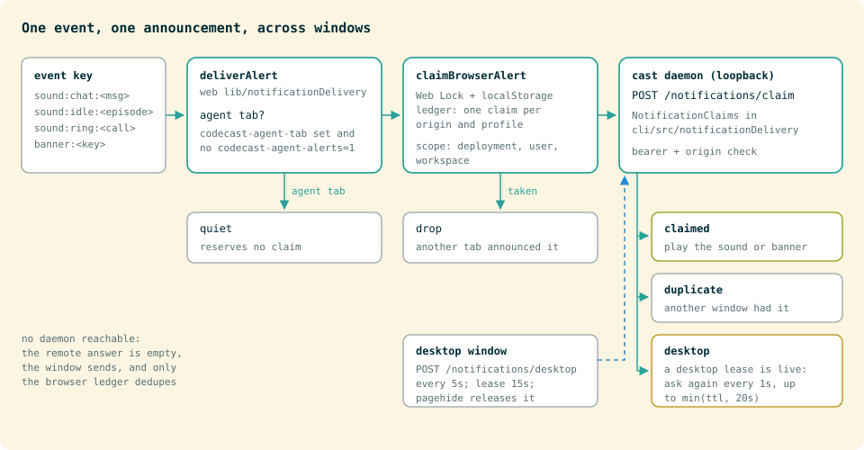

# Notification delivery across windows

Agent-controlled tabs suppress automatic sound effects, previews, browser notification permission requests and OS banners. In-page toasts, messages, unread counts and badges still render. The gate reads the existing `codecast-agent-tab` session-storage marker at delivery time, including when an agent attaches after the page has loaded. It never changes synced sound preferences.

For an explicit notification or sound test, enable alerts only in that tab:

```sh
cast browser eval 'sessionStorage.setItem("codecast-agent-alerts", "1")'
```

Restore quiet behavior after the test:

```sh
cast browser eval 'sessionStorage.removeItem("codecast-agent-alerts")'
```

The override permits delivery; it does not override the user's mute settings, browser permissions, autoplay policy or duplicate-event checks. Automated tests should intercept AudioContext and Notification rather than playing sounds or posting real banners.

## Arbitration



`deliverAlert` in `packages/web/lib/notificationDelivery.ts` claims events by key. Chat sounds use the message ID (`sound:chat:<id>`), OS banners use the notification key (`banner:<key>`), waiting sessions use the session's waiting episode (`sound:idle:<key>`), and call rings have 2.5 second claims (`sound:ring:<call>`). Sound and banner claims are separate, so one message can produce one of each. Walkie cues are not claimed at all: the incoming-burst cues play only in the announcer window (the shell's elected leader or the voice host), and the rest answer the person's own key in the window that pressed it.

Browser windows serialize claims with Web Locks (`claimBrowserAlert`) and retain a bounded, expiring ledger in localStorage (`codecast-notification-claims`, 500 entries). If the lock is not granted within three seconds the alert is dropped. A claim is shared across tabs of the same origin and profile. Agent tabs do not reserve claims. A later window opening, or an agent attaching while a delivery is waiting, cannot replay a claimed event.

`useNotificationDelivery` (`packages/web/hooks/useNotificationDelivery.ts`, mounted by `DesktopProvider`) discovers the authenticated loopback daemon using the existing terminal endpoint discovery (`getTerminalEndpoint`). The daemon side is `NotificationClaims` and `handleNotificationHttp` in `packages/cli/src/notificationDelivery.ts`, an in-memory ledger of at most 2,000 claims. `/notifications/claim` arbitrates across browser profiles, development origins and the Electron app on that machine. It uses the same origin allowlist and bearer-token check as the terminal. Claims are scoped to the deployment, signed-in user and workspace; no chat text is sent to the daemon or stored in its ledger.

An authenticated desktop window with its notification feed ready renews `/notifications/desktop` every five seconds. Browser requests defer to that lease. Desktop closes release it on pagehide; a crash expires it after fifteen seconds. A browser with a pending alert checks again every second until desktop handles it or the lease disappears, bounded by the alert's freshness budget (the smaller of its claim TTL and 20 seconds). Room-local cues (the huddle knock, recording on and off) claim with `preferDesktop: false`, so they do not defer to an unrelated desktop room.

The desktop shell still chooses which of its windows may sound an announcement. Its native banner routing and deduplication stay in place. Browser OS banners are silent; the app supplies the sound.

## Compatibility

Without an updated local daemon, or when local-network access is unavailable, browser tabs still deduplicate within their origin and profile. Desktop/browser and cross-origin coordination require the updated daemon and a reachable authenticated loopback connection. There is no account-wide desktop-presence fallback: a desktop running on a different computer must not silence this one.

Sound-category and volume preferences continue to sync across devices. The Sounds settings text describes that scope explicitly.
