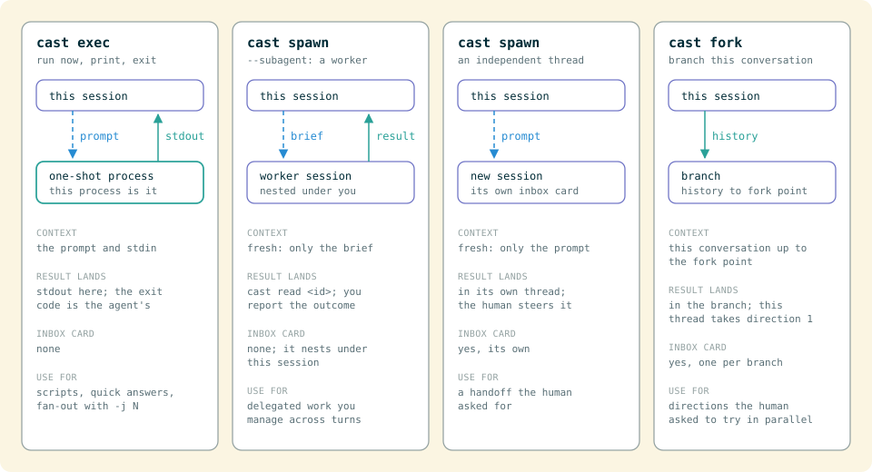

# `cast exec`: print mode for every agent harness

`cast exec` runs a prompt on any harness we launch, prints the result, and exits. It is the scripting form of `claude -p`, with one set of flags for Claude, Grok, Codex, Cursor, OpenCode, pi, Muse, and Gemini.

The process is the session. Stdout is the result. The exit code is the agent's. There is no inbox card.

One launcher, three shapes: a single run (the default), a parallel fan out (`-j`), and a chain of named agent definitions (`--chain`). Each is described below.

```bash
cast exec "summarize this repo"
cast exec --agent grok --model grok-4.6 --effort high "review the diff"
git diff | cast exec --agent claude --model sonnet "write a commit message"
cast exec --output-format json --max-turns 4 "list the public API"
cast exec --dry-run --agent codex "what command would run"
cast exec -j 3 "audit auth" "audit billing" "audit sync"
cast exec --as reviewer "review the staged diff"
cast exec --chain implement "add retries to the sync loop"
```

## What it is not

| Command | What it does |
|---|---|
| `cast exec` | Run a prompt now. Print the result. Exit. |
| `cast spawn` | Start a session in the inbox and return immediately. |
| `cast ask` | Search conversation history. |
| `cast claude` | Pass flags through to the Claude binary only. |
| `cast remote run` | Drive a session that was moved to a remote Mac. |
| `cast workflow run` | Run a `.cast` graph with several steps. |



`cast spawn` is the inbox verb. `cast exec` is the script verb. If you want a card you can `cast send` and `cast read`, use spawn. If you want stdout in this process, use exec.

`cast claude -p "…"` still works. It is a raw pass-through. `cast exec --agent claude` is the same idea with unified flags, and it works for the other harnesses too.

## Flags

Shared across harnesses. Each maps onto that client's native headless form (`claude -p`, `grok -p`, `codex exec`, `cursor-agent -p`, `opencode run`, `pi -p`, `muse exec`, `gemini -p`).

| Flag | What it does |
|---|---|
| `--agent` | `claude` (default), `codex`, `cursor`, `gemini`, `opencode`, `pi`, `grok`, `muse` |
| `-m` / `--model` | Picker key (`opus`) or a raw id (`grok-4.6`) |
| `--effort` | Reasoning effort. Levels vary by agent (claude: `low\|medium\|high\|max`) |
| `--as` | Run as a named agent definition (`cast agent ls`). Explicit flags override it |
| `--chain` | Run a named chain; the prompt is the task (see below) |
| `-j` / `--jobs` | Parallel: each prompt is its own run, at most n at once |
| `--task` / `--plan` | Record a chain or parallel run against a task (`ct-N`) or plan (`pl-N`) |
| `-C` / `--dir` | Working directory |
| `--output-format` | `text` (default), `json`, or `stream-json` |
| `--permission-mode` | `bypass` (default), `default`, `acceptEdits`, `full_auto`, or a native mode |
| `-r` / `--resume` | Resume a previous session by id |
| `-c` / `--continue` | Continue the most recent session in this directory |
| `--max-turns` | Cap turns (claude, grok) |
| `--system-prompt` | Replace the default system prompt (claude, grok, pi) |
| `--append-system-prompt` | Append to the default system prompt (claude, grok, pi) |
| `--json-schema` | Constrain the final answer (claude, grok) |
| `--bare` | Skip hooks / plugins / CLAUDE.md discovery (claude; opencode `--pure`) |
| `--isolated` | Start in a git worktree (grok, cursor, gemini) |
| `--timeout` | Kill the run after this long (`30s`, `2m`, `10m`) |
| `--quiet` | Parallel and chain runs: no progress lines on stderr |
| `--dry-run` | Print the resolved command and exit |

A flag the chosen agent cannot honor is ignored, with a warning on stderr.

Permission defaults to bypass, same as a session the daemon launches, so a script does not hang on a TUI prompt. Pass `--permission-mode default` to keep the client's own prompts.

## Stdin

```bash
cast exec "summarize this repo"          # prompt is the argument
cast exec - <<'EOF'                      # prompt is stdin
…multi-line…
EOF
echo "what is 2+2?" | cast exec          # prompt is the pipe
git diff | cast exec "write a commit message"   # prompt is the argument; the pipe is extra context
```

When a prompt argument is present and stdin is piped, the child inherits stdin. That is how `cat file | claude -p "query"` works, and exec keeps that shape.

## Parallel runs and chains

`-j <n>` runs each prompt as its own process, at most n at once. Prompts come from the arguments, or from stdin with several `-` arguments split on lines containing only `---` (the same convention as `cast spawn`). Progress goes to stderr; stdout gets one `### task N` block per prompt, or a single `{ tasks, ok }` object with `--output-format json`. The exit code is 0 only if every run succeeded.

`--chain <name>` runs a chain defined with `cast agent chain create`: each step is a named agent definition, and each step's output feeds the next step's prompt. `cast agent run <chain> "task"` is the same thing. `-j` and `--chain` do not combine.

Both shapes record a workflow run you can see with `cast workflow runs`, attached to `--task` or `--plan` when given. A parallel run without `cast auth` still runs; only the record is skipped.

## Output and exit

- stdout: the agent's result
- stderr: warnings, ignored flags, errors
- exit 0: the agent succeeded
- exit 124: `--timeout` fired
- any other code: the agent's own failure code

`--output-format json` is the agent's native JSON, not a Codecast envelope. Pipe it to `jq` as you would with `claude -p --output-format json`.

`--dry-run` prints the resolved binary and args, then exits 0. Use it to check the mapping without spending a turn.

## Auth and the daemon

A single run does not need `cast auth`. It launches the local agent CLI, so that CLI must be installed and logged in. `--as` and `--chain` read the workspace's agent definitions, so they do need `cast auth`.

If the Codecast daemon is running and watching this project, the transcript still syncs. You can `cast read` it later. The run itself does not create an inbox card.

To start work on another machine, use `cast spawn --device <name>` instead, or `cast spawn --cloud` for an isolated worktree on the cloud host. Exec always runs here.

## Shared with `cast spawn`

`cast spawn` takes the same `--agent`, `--model`, `--effort` and `--as`, so one definition or model choice works in both. Spawn returns immediately with a session id; exec waits and prints.
