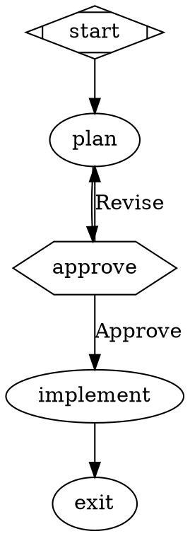

# Fabro Analysis: Learnings for Codecast

## What Fabro Is

Fabro is an open-source (MIT) AI workflow orchestration platform. Single Rust binary, zero runtime dependencies. Workflows are defined as Graphviz DOT graphs where each node is a stage (agent, command, human gate, conditional, parallel) executed by a deterministic engine. It targets expert engineers who want structured, repeatable agent processes instead of one-shot prompting or babysitting.

Core pitch: "Define your process as a graph, let agents execute it, intervene only where it matters."

## Architecture Overview

- **28 Rust crates** in a workspace -- CLI, workflow engine, agent, LLM providers (Anthropic/OpenAI/Gemini), 6 sandbox types (local/Docker/SSH/Daytona/Sprites/exe.dev), API server (Axum), git storage, MCP, GitHub/Slack/Linear integrations
- **React 19 web UI** -- Kanban runs board, run detail (graph, stages, files, verification, usage, retro), SSE streaming
- **OpenAPI-first** -- YAML spec generates both Rust types (typify) and TypeScript client (openapi-generator)
- **Single binary distribution** -- `cargo build` produces one executable

## What They Do Well (Learnings)

### 1. Workflow-as-Code (Graphviz DOT)

Their strongest idea. Workflows are `.fabro` files in standard DOT syntax with semantic extensions:



**Why it matters:** Workflows become diffable, reviewable, version-controlled artifacts. You can PR a workflow change. This is what our `cast plan decompose` + task graph aspires to, but Fabro's representation is more explicit and visual.

**Codecast opportunity:** We already have plans with task dependencies (blocked_by). Our graph is implicit in the dependency edges. We could:
- Add DOT export/import for our plan task graphs (we have `cast plan export` already)
- Add a visual graph renderer to the web UI (Fabro uses viz.js for client-side Graphviz)
- Let users define workflow templates as graphs, not just flat task lists

### 2. Model Stylesheet (CSS-like routing)

Assign models to workflow nodes using CSS selector specificity:

```
*        { model: claude-haiku-4-5; reasoning_effort: low; }
.coding  { model: claude-sonnet-4-5; reasoning_effort: high; }
#review  { model: gemini-3.1-pro-preview; }
```

Specificity: `#id` (3) > `.class` (2) > `shape` (1) > `*` (0)

**Why it matters:** Separates model selection from workflow logic. One-line change to swap all coding tasks to a different model. Enables cost optimization (cheap models for planning, expensive for implementation).

**Codecast opportunity:** Our autopilot hardcodes `model: "opus"`. We should add model routing to plans -- either per-task attributes or a stylesheet that applies across the plan. The CSS metaphor is elegant and familiar to developers.

### 3. Git Checkpointing

After every stage, Fabro commits code changes + execution metadata to a git branch (`fabro/runs/{ulid}`). Trailers link the commit to the run:

```
fabro(01JXYZ): implement (success)
Fabro-Run: 01JXYZ
Fabro-Completed: 3
```

**Why it matters:** Full audit trail. Resume from any point. Compare runs by diffing branches. Create PRs from completed runs.

**Codecast opportunity:** Our agents commit to worktree branches, but we don't checkpoint orchestration metadata into git. Adding structured commit trailers (plan ID, task ID, wave number) would make the git history machine-queryable. Our `cast plan merge` could verify these trailers.

### 4. Automatic Retrospectives

Post-run, an LLM generates a structured narrative:
- Smoothness rating (effortless/smooth/bumpy/struggled/failed)
- Intent, outcome, learnings
- Friction points (retry/timeout/wrong_approach)
- Open items (tech_debt/follow_up/investigation)

**Why it matters:** Continuous improvement loop. You can query retros across runs to find systemic issues.

**Codecast opportunity:** We track execution_status and concerns per task, but don't generate plan-level retrospectives. Adding `cast plan retro <plan_id>` that synthesizes all task comments, failures, and drive round findings into a narrative would close this loop. Could store in the plan's activity_log.

### 5. Verification as First-Class Concept

Build/test gates aren't suggestions -- they're nodes in the graph with `goal_gate=true`. Failures trigger automatic fix loops with `max_visits` to prevent infinite retries.

```dot
validate [prompt="Run tests", goal_gate=true]
gate [shape=diamond]
gate -> exit [condition="outcome=success"]
gate -> implement [label="Fix", max_visits=3]
```

**Why it matters:** Codifies the "implement -> test -> fix" loop that our agents do ad-hoc. The `max_visits` cap prevents runaway retries.

**Codecast opportunity:** Our `cast plan verify --all` runs checks after the fact. We should make verification a task dependency -- task X has a verification task Y that must pass. The autopilot already has retry logic; we need to formalize it into the task graph.

### 6. Sandbox Trait Abstraction

Unified interface across 6 execution environments:

```rust
pub trait Sandbox: Send + Sync {
    async fn exec_command(...) -> Result<ExecResult>;
    async fn read_file/write_file(...) -> Result<...>;
}
```

Local, Docker, SSH, Daytona, Sprites, exe.dev all implement it transparently.

**Why it matters:** Agent code doesn't care where it runs. Switch from local to cloud sandbox with one config change.

**Codecast opportunity:** Our agents always run locally. For enterprise/team use, cloud sandboxes would enable: running agents 24/7 on servers, isolation between agents, reproducible environments. The sandbox abstraction pattern is the right way to add this.

### 7. Event-Driven Observability

Every action emits a `WorkflowRunEvent` to multiple sinks:
- `progress.jsonl` (persistent log)
- `live.json` (latest state)
- SSE stream (web UI)
- tracing (debug logs)

**Why it matters:** Single event model drives all observability. The web UI, CLI monitoring, and post-run analysis all consume the same events.

**Codecast opportunity:** Our orchestration events table in Convex is similar but less structured. We should define a formal event enum for our orchestration (agent_spawned, task_completed, merge_succeeded, drive_round_started, etc.) and stream these to the web UI via Convex subscriptions.

### 8. Runs Board (Kanban UI)

Four columns: Working, Pending (human input needed), Verify, Merge. Drag-and-drop. Each card shows PR info, additions/deletions, CI status.

**Codecast opportunity:** Our PlanBoardView has Open/InProgress/Done/Dropped columns. We should add a "Verify" column and surface CI/check status on cards. The Pending column for human gates maps to our `needs_context` execution status.

### 9. Fidelity Control

Controls how much context passes between stages:
- `full` -- complete history
- `compact` -- structured summary (default)
- `summary:high/medium/low` -- variable detail
- `truncate` -- minimal (goal + run ID only)

**Why it matters:** Prevents context window overflow on long workflows. Cheap stages don't need full history.

**Codecast opportunity:** Our agent prompts include all done tasks as context, which grows linearly. We should add fidelity control to `buildImplementerPrompt` -- for wave 5+, summarize done tasks rather than listing all of them.

### 10. SWE-Bench Evaluation Framework

300 Python bug-fix tasks across 12 repos. Automated evaluation pipeline: generate patches, run test suites, grade pass/fail, track on scoreboard.

**Codecast opportunity:** We should build an eval suite for our orchestration system. Run a known plan (e.g., the orchestration plan itself) repeatedly, measure: tasks completed, retry rate, merge conflict rate, time per wave.

## What We Should NOT Adopt

### 1. Graphviz DOT as Primary Format
DOT is good for visualization but awkward for authoring complex workflows. Our task-based model (title, description, acceptance criteria, dependencies) is more natural for the kinds of work codecast handles. Keep DOT for visualization/export, not as the primary authoring format.

### 2. Rust Binary
We're a TypeScript/Convex stack. Rewriting in Rust would be a complete detour. The agent runtime abstraction we just built (claude-code/codex/tmux backends) gives us the same subprocess model without Rust.

### 3. Their LLM Client Layer
They built their own multi-provider LLM client across 4 crates. We use the Anthropic SDK directly plus our agent runtime (which delegates to `claude` or `codex` CLI). No need to build a provider abstraction -- the CLI tools handle that.

### 4. Their Sandbox Infrastructure
Daytona, exe.dev, Sprites -- these are cloud VM providers. Interesting for enterprise but premature for us. Our worktree isolation + local execution is sufficient for now. Worth revisiting when we need cloud agent execution.

## Integration Recommendations

### Immediate (pull patterns, not source)

1. **Model routing for plans** -- Add `model` field to tasks, plus a plan-level `model_stylesheet` that applies CSS-like rules. Modify `buildImplementerPrompt` and the agent runtime to use per-task models instead of hardcoded `opus`.

2. **Structured commit trailers** -- When agents commit, add `Codecast-Plan: pl-xxxx` and `Codecast-Task: ct-xxxx` trailers. Makes git history queryable by plan/task.

3. **Plan retrospectives** -- `cast plan retro <plan_id>` that calls an LLM with all task comments, drive findings, and execution stats. Stores narrative in plan activity_log.

4. **Fidelity control in prompts** -- Truncate done-task context in `buildImplementerPrompt` when the list exceeds ~20 items. Summarize instead of listing.

5. **Verification task dependencies** -- Allow tasks to have `verify_with: ct-xxxx` that auto-creates a linked verification task. Autopilot runs verification before marking parent done.

### Medium-term (build new features inspired by Fabro)

6. **Visual workflow graph in web UI** -- Render plan task graphs as SVG using viz.js (same as Fabro). Show dependency edges, status colors, critical path highlighting.

7. **Event streaming to web UI** -- Define `OrchestrationEvent` enum (agent_spawned, task_completed, merge_succeeded, etc.). Stream via Convex subscription to a live orchestration dashboard.

8. **Workflow templates as graphs** -- Let users define reusable workflow patterns (plan-implement-verify, implement-review-fix loop) as graph templates. The `createFromTemplate` mutation we built is the foundation.

9. **Runs board enhancement** -- Add Verify and Merge columns to PlanBoardView. Show CI/check status badges. Surface `needs_context` tasks prominently.

### Long-term (if/when needed)

10. **Cloud sandbox execution** -- Abstract agent execution behind a sandbox interface. Start with "local" (current), add "docker" and "cloud" backends later.

11. **Multi-provider model routing** -- When users want to use GPT for planning and Claude for coding, the stylesheet pattern is the right abstraction.

12. **Eval framework** -- Build an automated evaluation pipeline that runs known plans and measures completion rate, retry rate, merge conflict rate, time per wave.

## Key Takeaway

Fabro's core insight is that **agent orchestration should be a graph with typed nodes, model routing, and checkpoint semantics** -- not a flat task list with ad-hoc scripting. We've built the task/dependency infrastructure; the next step is adding the graph visualization, model routing, and structured event streaming that make the orchestration observable and controllable.

Their strongest patterns to adopt: model stylesheets, git trailers, auto-retros, fidelity control, verification gates. Their weakest area for us: the DOT authoring experience and the Rust distribution model. We should pull the concepts, not the code.
