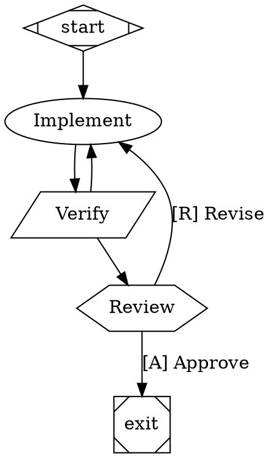

# My project

User prose that lives ABOVE every codecast block. An install must leave this
byte-identical.

## Messaging

STALE MESSAGING BODY — a short stand-in for whatever an older CLI wrote here.
Installing the `messaging` snippet must replace this block rather than stack a
second copy under it.
<!-- /codecast-messaging -->

## House rules

A user's own section sitting BETWEEN two codecast blocks. Nothing may move it.

## Deploy notes

The last user section. It follows the codecast blocks, so anything that cuts a
block by "everything to end of file" destroys this paragraph.

## Workflows

Workflows are execution graphs (DOT syntax) that define multi-step processes with loops, conditions, and human approval gates. They bind to tasks or plans.

```bash
cast workflow run flow.cast --task ct-xxxx  # Execute workflow for a task
cast workflow run flow.cast --plan pl-xxxx  # Execute workflow for a plan
cast workflow list                          # Available templates
cast workflow push                          # Push workflow to web UI
```

Workflow nodes can be: agent sessions (`backend=claude`), shell commands, human approval gates, or conditionals. The web dashboard shows workflow progress and gate buttons.

When collaborating on workflow creation, use DOT syntax:

<!-- /codecast-workflows -->

## Referencing objects

Every codecast object has a short ID. Write one into your prose and it renders as a live reference: the object's title, its current state, and a link that opens it. This works anywhere you write — messages, summaries, task comments, doc bodies, trigger prompts.

| Object  | Short ID  | Where to find it |
|---------|-----------|------------------|
| Session | `jx7c6zk` | `cast feed`, `cast search`, `cast context` |
| Task    | `ct-4102` | `cast task ls`, `cast task ready` |
| Plan    | `pl-88`   | `cast plan ls` |
| Trigger | `tr-42`   | `cast trigger ls` |
| Doc     | `doc:<id>` | `cast doc ls`, `cast doc search` |

There are two forms. Write the bare ID by default — `Filed under ct-4102.` — it reads as a normal sentence and still renders the full reference. Write `@[Title id]` — `@[Fix the auth race ct-4102]` — when the reader needs the name in the sentence itself.

Never paste an object's 32-character internal ID into prose. It renders as an unreadable blob, and every command that accepts an ID accepts the short one.
<!-- /codecast-references -->
