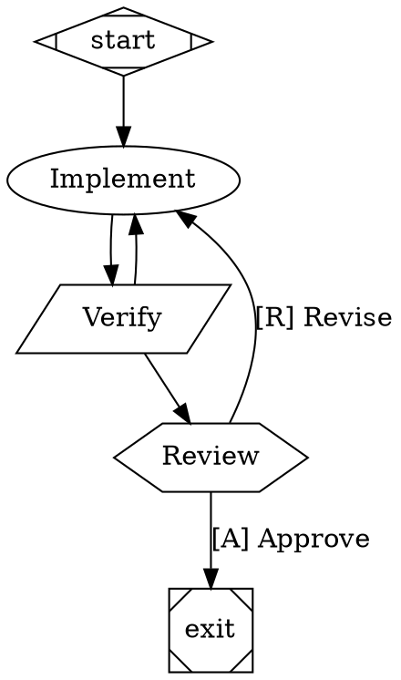

# My project

User prose that lives ABOVE every codecast block. An install must leave this
byte-identical.

## Messaging

STALE MESSAGING BODY — a short stand-in for whatever an older CLI wrote here.
Installing the `messaging` snippet must replace this block rather than stack a
second copy under it.
<!-- /codecast-messaging -->

## House rules

A user's own section sitting BETWEEN two codecast blocks. Nothing may move it.

## Referencing objects

Every codecast object has a short ID. Written anywhere (messages, summaries, task comments, doc bodies, trigger prompts), it renders as a live reference: title, current state, and a link.

| Object  | Short ID  | Where to find it |
|---------|-----------|------------------|
| Session | `jx7c6zk` | `cast feed`, `cast search`, `cast context` |
| Task    | `ct-4102` | `cast task ls`, `cast task ready` |
| Plan    | `pl-88`   | `cast plan ls` |
| Trigger | `tr-42`   | `cast trigger ls` |
| Doc     | `doc:<id>` | `cast doc ls`, `cast doc search` |

Write the bare ID by default (`Filed under ct-4102.`); it reads as a normal sentence and still renders in full. Write `@[Title id]` (`@[Fix the auth race ct-4102]`) when the sentence needs the name. Never paste a 32-character internal ID: it renders as an unreadable blob, and every command accepts the short one.
<!-- cast @VERSION@ -->
<!-- /codecast-references -->

## Deploy notes

The last user section. It follows the codecast blocks, so anything that cuts a
block by "everything to end of file" destroys this paragraph.

## Workflows

Workflows are DOT execution graphs with loops, conditions and human approval gates, bound to a task or plan. Nodes are agent sessions (`backend=claude`), shell commands, approval gates or conditionals; the dashboard shows progress and gate buttons.

```bash
cast workflow run flow.cast --task ct-N     # or --plan pl-N
cast workflow list                          # available templates
cast workflow push                          # push a workflow to the web UI
cast workflow runs [--task ct-N|--plan pl-N] # status, task, current node, gate
cast role line @handle [--set <slug>]       # read or set the workflow a role's tasks run on (default: line)
```


```dot
digraph my_flow {
  graph [goal="$task_title"]
  start [shape=Mdiamond]
  implement [label="Implement", backend=claude, prompt="..."]
  verify [label="Verify", shape=parallelogram, script="npx tsc --noEmit"]
  review [label="Review", shape=hexagon]
  exit [shape=Msquare]
  start -> implement -> verify
  verify -> review [condition="outcome = success"]
  verify -> implement [condition="outcome = failure"]
  review -> exit [label="[A] Approve"]
  review -> implement [label="[R] Revise"]
}
```
<!-- cast @VERSION@ -->
<!-- /codecast-workflows -->
