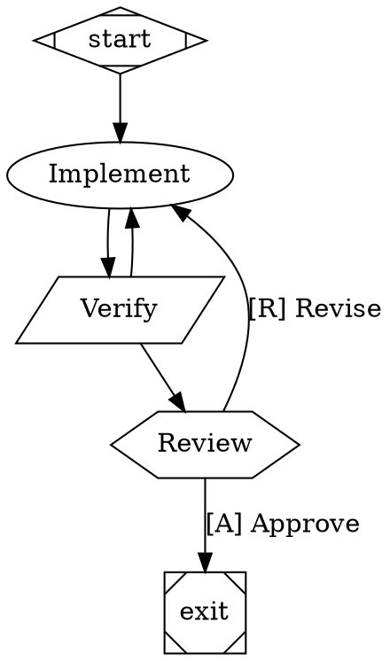

Workflows are execution graphs: multi-step processes written in DOT syntax where each node is an agent session, a shell command, a condition, or a human approval gate. Where a single agent prompt describes intent and hopes, a workflow encodes the actual control flow — retry loops, verification steps, and the points where a human must sign off before anything proceeds.

The workflow snippet is installed via [the snippet system](/documentation/agent-snippets):

```bash
cast workflow install
```

## The shape of a workflow

Workflows are `.cast` files in DOT graph syntax — the same language Graphviz reads, so any DOT tool can render one:



This graph loops: implementation runs, a typecheck verifies it, failure routes back to implementation, success routes to a human review gate, and the reviewer's choice either exits or sends the work back with feedback. Node shapes carry meaning — a parallelogram is a shell command, a hexagon is a human gate — and edge conditions route on each node's outcome.

Node types:

- **Agent** (`backend=claude`, `backend=codex`, …): spin up an agent session with a prompt; the plan or task context rides along.
- **Command** (`script="…"`): run a shell command; its exit status and output drive downstream conditions.
- **Human gate**: pause the run and wait. The gate shows up in the dashboard with its choices as buttons, and a push notification reaches you on mobile and desktop.
- **Conditional edges**: `condition="outcome = success"` routes on the previous node's result.

## Running

Workflows bind to [tasks and plans](/documentation/tasks-and-plans), which is where they get their goal and context:

```bash
cast workflow run flow.cast --task ct-4102
cast workflow run flow.cast --plan pl-88
cast workflow list             # available templates
cast workflow push             # publish the definition to the web UI
```

A run creates a primary conversation in the inbox; each agent node gets its own session, streamed live to the dashboard with the graph's progress alongside. Human gates hold the run until you answer — reply through the normal message composer or click the gate button, and the workflow resumes with your input passed to the next node.

## When to use which

Workflows overlap with [orchestration](/documentation/orchestration), and the split is determinism. A workflow executes a graph you wrote: same steps, same gates, every run — right for release checklists, verify loops, anything with a compliance step. Orchestration hands a plan to a conductor agent that decides decomposition and scheduling itself — right for open-ended builds where the structure isn't known up front. [Triggers](/documentation/triggers) cover the third case: a single follow-up on a timer or an event, no graph needed.
